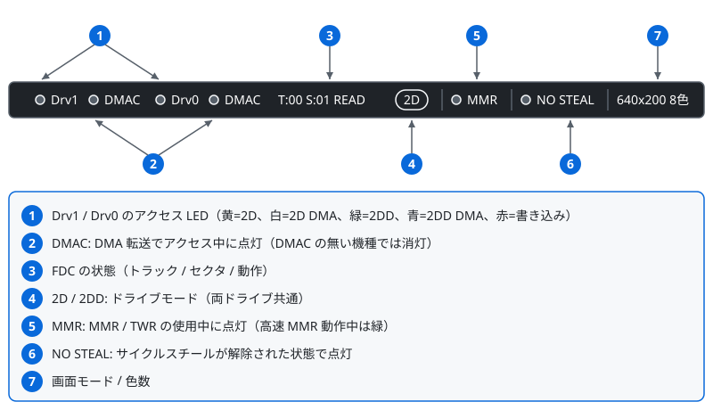

# HOWTO — 開発者向けガイド

WebM7 をローカル環境で動かす方法と、ソースコードの構成について説明します。

## ローカルでの起動方法

ES Modules (`import`) を使っているため、ファイルを直接ブラウザで開くと動きません。ローカルに HTTP サーバーを立ててください。

※ Visual Studio Code の Live Server 拡張がオススメです。

```bash
# Python 3 の場合
python -m http.server 8080

# Node.js (npx) の場合
npx serve .
```

ブラウザで `http://localhost:8080` を開きます。

互換 ROM セット（`assets/altroms/`）を同梱済みのため、ROM ファイルなしでそのまま起動できます。互換 ROM セットの配布元と権利表示は [README.md](README.md) のライセンスの節を参照してください。

ROM ファイルの読み込みや操作方法については [README.md](README.md) を参照してください。
キーボードの配置・固有キーの対応・キーの割り当て変更は [docs/Keyboard_Manual.md](docs/Keyboard_Manual.md) にまとめています。

## ソース構成

```
index.html          メイン画面 & UI
CHANGELOG.md        更新履歴（Markdownテーブル形式、モーダルに動的読み込み）
manifest.webmanifest  PWA マニフェスト
sw.js               PWA サービスワーカー（オフライン対応・アプリシェルのキャッシュ）
icons/              PWA アイコン一式（192/512/maskable/apple-touch/favicon）
css/
  style.css         スタイルシート（機種テーマ・スキン・ハードウェアパネルの配色を含む）
  softkbd.css       ソフトウェアキーボードのスタイル
assets/
  granite.png       FM77AV40SX スキンのテクスチャ
  altroms/          同梱の互換 ROM セット（独立実装・MIT License）
core/               共有エンジン（View 横断で再利用する中核）とブラウザ結合部
  [エンジン部: ブラウザ API 非依存。Node.js から直接動かせる（docs/Headless_Test_Manual.md）]
  index.js          コアの公開 API 窓口（FM7 / D77Disk / CPU6809 / Display / キーボード定数 等を再エクスポート）
  fm7.js            システム全体の統合クラス（メモリマップ、I/O、スケジューラ連携、キーボードエンコーダ）
  cpu6809.js        MC6809 CPU エミュレーション
  display.js        画面生成（VRAM、ALU、ライン描画、パレット、320×200/640×200/640×400/262K色。RGBA フレームへ描く）
  fdc.js            フロッピーディスクコントローラ（MB8877、D77/2Dパーサ、論理フォーマット）
  hfe.js            HFE イメージのデコード
  cmt.js            カセットテープコントローラ（T77パーサ、バイトオーダー自動検出、FSKスケール自動検出）
  keyboard.js       キーボード入力（FM-7 ASCIIモード / FM77AV スキャンコードモード、カスタムリマップ対応）
  psg.js            PSG音源（AY-3-8910）のレジスタと波形生成
  opn.js            OPN FM音源（YM2203: 3ch FM合成 + SSG + タイマー）
  scheduler.js      タイミング制御（デュアルCPU同期、イベントスケジューラ）
  [ブラウザ結合部: DOM / Canvas / Web Audio を扱う。index.html はここから FM7Browser を生成する]
  fm7_browser.js    FM7 をブラウザに結び付ける（キー・フォーカスイベント、描画ループ、ゲームパッド、BEEP、音声の開始）
  display_canvas.js 画面のフレームを Canvas へ写す（ImageData / putImageData）
  audio_output.js   PSG / OPN の Web Audio 出力段（AudioContext / AudioWorklet の生成・再開・停止）
  audio-worklet-processor.js  AudioWorklet 用リングバッファプロセッサ
  fdd_sound.js      FDD動作音合成（シーク・ヘッドロード・モーター・挿入/取出し音）
  softkbd.js        ソフトウェアキーボード（タッチ端末向け。スマホ縦向き専用レイアウト、画面直下ドック）
  cgrom_glyph.js    CG ROMグリフレンダラ（8×8 1bpp → PNG data URL、Keyboardパネルのキートップ表示用）
```

## 画面 UI の構成

`index.html` の UI は次の 3 か所に分かれています。スタイルは `css/style.css` にまとまっています。

| 要素 | DOM | 役割 |
|---|---|---|
| ヘッダー | `.app-header` / `#machineTabs` / `#skinChips` / `#capBadgeRow` | 機種タブ、スキン切り替え、能力バッジと RAM / VRAM 容量表示 |
| ハードウェアパネル | `#hwPanel`（`#hwTower` / `#hwBar`） | 電源・リセット・起動モード・ドライブの操作部。機種ごとの配色 |
| サイドパネル | `.side-panel` の各 `.sp-section` | Options / ROM Files / Library / Disk Images / Tape Image / BASIC Paste |




- 機種タブ・ハードウェアパネルの操作は、いずれもサイドパネル内の既存コントロール（`#machineTypeSelect`、`#powerToggle`、`#resetBtn`、`bootMode` ラジオ）へ委譲します。これらは状態源として DOM に残し、表示だけを隠しています。
- スキンは `<body>` の `ui-skin-*` クラスで切り替わります。選択可能なスキンは `index.html` の `UI_SKIN_CHOICES`、スキンの無い機種の割り当ては `UI_MACHINE_GROUPS` で定義しています。選択は `uiSkins` 設定としてブラウザに保存されます。
- 機種による表示差（LED 色、無変換 / 変換キーの有無、BREAK キーの色、ドライブベイの形状）は `<body>` の `machine-fm7` / `machine-av` / `machine-av20up` クラスで制御します。

## 対応機種

| 機種 | 画面モード | 音源 | キーボード |
|------|-----------|------|-----------|
| FM-7 | 640×200 8色 | PSG (AY-3-8910) | ASCIIコード |
| FM77AV | 640×200 8色 / 320×200 4096色 | PSG + OPN FM (YM2203) | スキャンコード + ブレイクコード |
| FM77AV20 | FM77AV + 2DD 対応 | PSG + OPN FM (YM2203) | スキャンコード + ブレイクコード |
| FM77AV20EX | FM77AV20 + DMAC + 高速MMR | PSG + OPN FM (YM2203) | スキャンコード + ブレイクコード |
| FM77AV40 | 640×200 / 320×200 4096色 / 262,144色 / 640×400 8色 | PSG + OPN FM (YM2203) | スキャンコード + ブレイクコード |
| FM77AV40EX/SX | FM77AV40 + EXTSUB.ROM (Type-D/E) | PSG + OPN FM (YM2203) | スキャンコード + ブレイクコード |

## ライセンス

[MIT License](LICENSE) © 2026 [7032](https://x.com/7032) / Naomitsu Tsugiiwa

本ライセンスは WebM7 自体の成果物（ソースコードのほか、本プロジェクトが作成したドキュメント・図・アイコン・テクスチャ等を含みます）に適用されます。第三者に権利が帰属する要素（各社ブランドロゴなど）には適用されません。FM 音源の FM 合成部（core/opn.js の一部）は "FM Sound Generator" (fmgen) Copyright (C) by cisc 1998, 2003 の移植で、原典の利用条件が適用されます（原文は core/fmgen_readme.txt を同梱）。同梱の互換 ROM セット（`assets/altroms/`）の条件は同梱の `assets/altroms/LICENSE` に従います（漢字系 ROM の字形の扱いは [LICENSE-Shinonome.md](LICENSE-Shinonome.md)）。詳細は [LICENSE-MIT.md](LICENSE-MIT.md)（「ライセンスの案内」の表と各 `LICENSE-*.md`） を参照してください。
