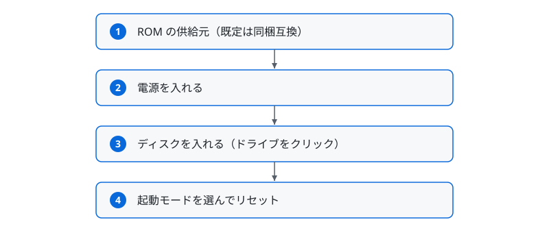

# WebM7 — FM-7 / FM77AV シリーズ Web Simulator

ブラウザ上で動く FM-7 / FM77AV シリーズ（FM-7 / FM-77 / FM77AV / FM77AV20 / FM77AV20EX / FM77AV40 / FM77AV40EX/SX）のシミュレータです。
GitHub Pages で動くページは https://7032jp.github.io/WebM7/ になります。

WebM7 は、ブラウザで FM-7 系の動作を体験し、対応ソフトウェアの開発・検証に利用できるシミュレータです。

**既定では、独立実装の互換 ROM セット [7032 Alternative ROMs](https://github.com/7032JP/7032AltROMs/tree/v1.0.0)（MIT License）を同梱・使用するため、ROM ファイルを用意しなくても初回アクセスだけで起動できます。** お手持ちの ROM ファイルを使う場合は、ROM Files パネルの各 ROM 行にある供給元の選択で、必要な ROM だけを 1 本単位で「自分の ROM」に差し替えられます。
純正 ROM の権利は各権利者に帰属します。ご自身が適法に所有する実機から取得したものをお使いください。

ご利用は各自の責任で、お住まいの国・地域の法令に従ってください。

**ROMファイルの取り扱いについて / ROM File Handling**
- 本シミュレータが同梱・配信するのは、独立実装の互換 ROM セット（MIT License。配布元は [7032 Alternative ROMs](https://github.com/7032JP/7032AltROMs/tree/v1.0.0)）のみです。純正 ROM は同梱も配信もしません。なお、漢字系 ROM（KANJI / KANJI2）に含まれる第三者素材由来の字形は、MIT License の対象外です（[LICENSE-FONT.md](assets/altroms/LICENSE-FONT.md) を参照）。
- 利用者がご用意された ROM ファイルは、ユーザーのブラウザ内（ローカル環境）でのみ処理します。ROMデータがサーバーに送信・保存されることはありません。
- FM-7 の DOS モードでは、起動のためにディスクの先頭部分を先読みすることがあります（ヘッドレス実行では `romAdjust` で無効化できます。[ヘッドレステスト マニュアル](docs/Headless_Test_Manual.md)を参照）。
- By default this simulator bundles and uses an independently implemented compatible ROM set ([7032 Alternative ROMs](https://github.com/7032JP/7032AltROMs/tree/v1.0.0), MIT License). This project neither bundles nor distributes original ROM files. Third-party glyphs in the kanji ROM images (KANJI / KANJI2) are not covered by the MIT License. For original glyphs and conversion processing, see [LICENSE-MIT.md](assets/altroms/LICENSE-MIT.md) and [LICENSE-FONT.md](assets/altroms/LICENSE-FONT.md).
- User-supplied ROM files are processed entirely within the user's browser (local environment). ROM data is never transmitted to or stored on any server.

※機種名・製品名は対応対象を示すために使用しています。本プロジェクトは各メーカーの公式製品ではなく、富士通株式会社とは一切関係ありません。

> 開発者向け情報（ローカルでの起動方法・ソース構成など）は [HOWTO.md](HOWTO.md) を参照してください。

## 主な機能

### FM-7
- デュアル MC6809 CPU（メイン実効 1.794 MHz / サブ公称 2.0 MHz）
- 640×200 8色表示、TTLパレット
- PSG 音源（AY-3-8910）
- FDC（MB8877）、D77/2D ディスクイメージ対応
- CMT（カセットテープ）、T77 / WAV テープイメージの読み込み・保存対応
- キーボード入力（ASCIIモード、JIS 106/109配列対応、キーリピート対応）
- INS/CAPS/カナ LEDインジケーター
- カーソルキー → テンキー代替プリセット（テンキーレスキーボード対応）
- ジョイスティック（FM音源カード相当）

### FM-77
- FM-7 と同じ ROM 構成（F-BASIC / 起動 ROM / サブシステム ROM）
- 3.5 インチ 2D フロッピーディスクドライブ内蔵の意匠（前面の BOOT ボタンで起動モードを選択）

### FM77AV
- 320×200 4096色モード＋アナログパレット
- ALU ハードウェアアクセラレータ、ライン描画エンジン
- OPN FM 音源（YM2203: 3ch FM + SSG）
- VRAMダブルページ、CG ROMバンク切替
- 機種別の起動モードに対応
- サブROMバンク切替（Type-A/B/C）
- MMR（192KB拡張RAM）
- スキャンコードキーボード、ブレイクコード

### FM77AV20
- FM77AV の全機能に加え、2DD フロッピーディスク対応

### FM77AV20EX
- FM77AV20 の全機能に加え、DMAC（HD6844）と高速MMR（MMR 使用時の速度低下を抑止）に対応

### FM77AV40
- 640×400 8色モード（400ライン表示）
- 320×200 262,144色モード
- MMR拡張モード（448KB拡張RAM、8バンク）
- RD512 / DMAC / CRTC スタブ対応

### FM77AV40EX/SX
- FM77AV40 の全機能に加え、EXTSUB.ROM（拡張サブシステム Type-D/E）に対応
- サブROMバンク切替（Type-A/B/C/D/E）

### 共通機能
- ヘッダーの機種タブによる機種切り替え（選択はブラウザに保存）
- 機種別ハードウェアパネル（実機の筐体を模した電源・リセット・起動モード・ドライブの操作部）
- スキン切り替え（FM-7 は FM-7 / FM-new7、FM77AV40EX は FM77AV40EX / FM77AV40SX。見た目のみ変更、機種ごとにブラウザへ保存）
- 起動モード選択（BASIC / DOS）
- 表示倍率の切り替え（Web標準 / x2＝1280×800 デバイスピクセル / x1＝等倍 640×400 デバイスピクセル）とフルスクリーン（FULL）
- ディスク / テープのライブラリ管理（ブラウザ内に複数イメージを保管・命名・挿入）
- ディスクの論理フォーマット（FAT / ディレクトリ初期化。空ディスクを `SAVE` 可能にする）
- FDD動作音（シーク・ヘッドロード・スピンドルモーター・ディスク挿入/取出し音を合成再現）
- スクリーンショットPNG保存（640×400 で出力）
- ソフトウェアキーボード（タッチ端末で表示。スマホ縦向きでは専用レイアウトに自動切替し、画面直下にドック）
- キーカスタマイズ（物理キーボード種別の選択、FM-7キーへの物理キー割当、ブラウザ保存）
- Keyboard パネルのキーをクリックして入力（ソフトウェアキーボード。PC・タッチ共通）
- ROM Info（読み込み済みROMのサイズ・ハッシュ表示、クリップボードへコピー）

## 使い方

### 1. ROM の供給元を選ぶ（既定はそのままでOK）

WebM7 は**同梱の互換 ROM セットを常に土台**として動作し、そのうえで **ROM 1 本（スロット）ごとに供給元を選べます**。ROM Files パネルの各 ROM 行にある選択で「同梱互換」か「自分の ROM」を指定してください。たとえば `FBASIC30.ROM` だけ、あるいは `KANJI.ROM` だけをお手持ちのものにする、といった使い分けができます。指定はブラウザに保存され、次回以降も維持されます。現在どの組み合わせで動作しているかは、同じ ROM Files パネル上部の **ROM Set** 表示で確認できます。

- **同梱互換（既定）** — 独立実装の互換 ROM セット（MIT License）を使用します。ROM ファイルの用意は不要で、初回アクセスだけで起動できます。漢字 ROM（KANJI.ROM・第1水準）も互換セットに同梱されており、漢字表示に対応しています。ソフトウェアの動作条件は、下記の互換 ROM の互換性情報を参照してください。第2水準漢字 ROM（KANJI2.ROM）と辞書 ROM（DICROM.ROM）も同梱され、FM77AV40EX/SX で必須です（辞書 ROM は機種構成に必要な容量を満たすためのデータで、かな漢字変換＝日本語入力には対応していません）。漢字系 ROM に含まれる第三者素材由来の字形は、MIT License の対象外です（同梱の `assets/altroms/LICENSE-FONT.md` を参照）。同梱互換 ROM の BASIC は、プログラムをアスキー形式（`SAVE ,A` と同じ形式）だけで読み書きします。中間コード（バイナリ）形式で保存されたファイルは読み込めません（[COMPATIBILITY.md §3.2](https://github.com/7032JP/7032AltROMs/blob/v1.0.0/docs/COMPATIBILITY.md)）。お手持ちのプログラムファイルをそのまま使う場合は、`FBASIC30.ROM` の行を「自分の ROM」に切り替えてください。保護保存（`SAVE` の `,P` 指定）にも対応していません。機械語ファイル（`SAVEM` / `LOADM`）の形式は従来どおりです
- **自分の ROM** — お手持ちの ROM ファイルを読み込んで使用します（下記）。ROM ファイルを読み込むと、**その行だけ**自動的に「自分の ROM」へ切り替わります。まだファイルを読み込んでいない行では、選択肢が「自分の ROM（未登録）」と表示されます

供給元を選べる ROM は次の 12 本です。`FBASIC30.ROM` / `BOOT_DOS.ROM` / `BOOT_BAS.ROM` / `SUBSYS_C.ROM` / `KANJI.ROM` / `INITIATE.ROM` / `SUBSYS_A.ROM` / `SUBSYS_B.ROM` / `SUBSYSCG.ROM` / `EXTSUB.ROM` / `DICROM.ROM` / `KANJI2.ROM`（FM77AV 以降でのみ使う ROM の行は、その機種を選んでいるときに表示されます）。

供給元の切り替えは、シミュレータの停止中に行えます。

各行の状態は横のタグで分かります。

| 表示 | 意味 |
|---|---|
| `OK` | 「自分の ROM」を指定していて、ファイルも読み込み済み |
| `互換` | 「同梱互換」を指定（同梱の互換 ROM で動作） |
| `補完` | 「自分の ROM」を指定しているがファイルが未登録で、同梱互換 ROM で補って動作 |

**ROM Set** 表示は混在に対応しています。すべて同梱互換なら「同梱互換 ROM」、すべて自分の ROM なら「自分の ROM」、混ざっているときは「同梱互換 ROM ＋ 自分の ROM n 件」と表示され、補完中の行があれば末尾に「（n 件を補完中）」が付きます。どの ROM がお手持ちのものかは、この表示にマウスを重ねると一覧で確認できます。

「自分の ROM」に指定した行のファイルがまだ読み込まれていない場合は、**その行だけ**同梱の互換 ROM で自動的に補って起動します。設定は不要で、常にこの動作です。お持ちの ROM が互換 ROM で置き換わることはありません。補われた ROM は各行に「補完」と表示され、**ROM Set** 表示にも補完中の件数が出ます。補う内容は選択中の機種の構成に従い（イニシエータ ROM の機種別のバージョン、`KANJI2.ROM` / `DICROM.ROM` は FM77AV40EX/SX のみ など）、その機種に無い ROM が足されることはありません。

選択した機種に合う ROM を指定してください。

**Clear ROMs** ボタンを押すと、ブラウザに保存した ROM を消去します（ディスクや Library はそのまま残ります）。消えた ROM を指したままにならないよう、供給元の指定もすべて「同梱互換」に戻ります。

以前のバージョンで **ROM Source** を選んでいた方の設定は、そのまま引き継がれます。「自分の ROM」だった方は全スロットが「自分の ROM」に、「同梱互換 ROM」だった方は全スロットが「同梱互換」に移行するため、起動する内容はこれまでと変わりません。

### 2. ROM ファイルを読み込む（「自分の ROM」に指定する行）

「自分の ROM」に指定した行には、以下の ROM ファイルが必要です（ご自身が適法に所有する実機から取得したものを用意してください）。「同梱互換」のままにする行は、ファイルを用意する必要はありません。

#### FM-7 共通ROM

| ファイル名 | 内容 |
|---|---|
| `FBASIC30.ROM` | F-BASIC V3.0 ROM（本体搭載 ROM。起動に常に必須） |
| `BOOT_BAS.ROM` | BASIC ブート ROM（FM-7 系を起動モード BASIC で起動する場合に必須。本体内蔵のブート ROM 相当） |
| `BOOT_DOS.ROM` | DOS ブート ROM（FM-7 系を起動モード DOS で起動する場合に必須） |
| `SUBSYS_C.ROM` | サブシステム ROM（CGフォント内蔵）。起動に常に必須 |
| `KANJI.ROM`    | 漢字 ROM（JIS第一水準）。**任意**。漢字ROMカード相当で、指定すると漢字を使うソフトで漢字が表示されます |

#### FM77AV 追加ROM

| ファイル名 | 内容 |
|---|---|
| `INITIATE.ROM` | イニシエータROM。FM77AV 系の起動に必須（`BOOT_BAS.ROM` / `BOOT_DOS.ROM` は不要） |
| `KANJI.ROM`    | 漢字 ROM（JIS第一水準、FM77AVでは必須。FM-7 でも任意で利用可） |
| `SUBSYSCG.ROM` | キャラクタージェネレータ ROM |
| `SUBSYS_A.ROM` | サブシステム Type-A ROM |
| `SUBSYS_B.ROM` | サブシステム Type-B ROM |

#### FM77AV40EX 追加ROM

| ファイル名 | 内容 |
|---|---|
| `EXTSUB.ROM` | 拡張サブシステムROM（Type-D/E、FM77AV40EXモードで必要） |
| `DICROM.ROM` | 辞書 ROM（FM77AV40EX/SX で必須） |
| `KANJI2.ROM` | 漢字 ROM（JIS第二水準、FM77AV40EX/SX で必須） |

読み込み方法は2通りあります。

- **フォルダ指定** — 「Folder」で上記ファイルが入ったフォルダを選択
- **個別指定** — 各 ROM を1つずつファイル選択

各 ROM の横に「OK」と表示されれば読み込み成功です。
読み込み後、**ROM Info** を開くと各ROMのサイズとハッシュ値を確認できます。

### 3. メディアイメージをセットする（任意）

- **ディスク** — D77 形式のディスクイメージを「Drive 0」「Drive 1」にセットできます。セットするとファイル名が表示されます
- **テープ** — T77 / WAV 形式のカセットテープイメージを「Tape Image」にセットできます。セットするとファイル名が表示されます
  - T77 テープイメージ形式に対応。ビッグエンディアン・リトルエンディアンの両バイトオーダーを自動検出します
  - **WAV 形式**にも対応。録音のノイズ・振幅変動・テープ速度の揺らぎ（ワウフラッター）を含む実録音も、信号を復調してクリーンな搬送波として再生成する方式と直接スライスする方式を自動で切り替えて読み込みます。読み込み時にデコード品質（正常ブロック数）を表示します
  - **REW** ボタンでテープを巻き戻し
  - テープ読み込み中（モーターON時）はシミュレータが自動的に高速化され、実時間の約1/50の速度でロードされます
  - BASIC で `SAVE` / `SAVEM` した内容は自動録音され、**録音→.t77** / **録音→.wav** ボタンでファイル保存できます

### 4. 起動

1. ヘッダーの**機種タブ**で機種を選択（**FM-7 / FM-77 / FM77AV / FM77AV20 / FM77AV40 / FM77AV20EX / FM77AV40EX** の順に並びます。FM77AV40EX タブは FM77AV40EX / FM77AV40SX を兼ねます）。機種ごとの機能差はタブの右に並ぶ能力バッジと「機種比較」リンクで確認できます
2. 機種別**ハードウェアパネル**で**起動モード**を選択（操作部の位置は機種・スキンによって変わります。下記「画面の構成」を参照）
   - **BASIC**（既定） — BASIC モードの起動 ROM で起動します。ディスクイメージがセットされていればディスクから、なければ BASIC が起動します（同梱互換 ROM では [7T-BASIC](https://github.com/7032JP/7032AltROMs/blob/v1.0.0/docs/BASIC_REFERENCE.md)、お手持ちの BASIC ROM を指定した行ではその BASIC）。テープからのプログラム読み込み（`RUN ""`、`LOAD`、`LOADM`）やBASICプログラミングが可能です
   - **DOS** — DOS モードの起動 ROM で起動します。起動可能なディスクイメージをセットしておいてください
3. ハードウェアパネルの**電源スイッチ**を押して起動
   - 起動に必要な ROM がまだ読み込まれていないときは、電源スイッチは淡色表示になり、押しても「ROMを設定してください」の案内が出ます。Options パネルにも「先に ROM を読み込んでください」と表示されます
   - もう一度押すと停止します。**リセット**もハードウェアパネルにあります
   - 画面下のステータスバーの **Pause** で一時停止・再開、**📷** ボタンで画面を PNG ファイルとして保存、表示倍率トグル右端の **FULL**（または F11 キー）でフルスクリーン表示に切り替えできます

画面（Screen）をクリックするとキーボード入力がシミュレータに渡ります。

そのほかの設定は次のパネルにあります。

- **FM Sound Card**（FM-7 / FM-77 のみ表示） — Options パネル。チェックを入れるとFM音源カード（OPN）を有効にします（反映は次の電源投入・リセット時）
- **Mouse** / **Joystick 1** / **Joystick 2** / **Cursor → Ten Key** — Options パネル（下記「ジョイスティック」も参照）。**Cursor → Ten Key** をチェックすると、テンキーのないキーボードでもカーソルキー（↑↓←→）がテンキーの 8/2/4/6 として動作します
- **Drive Sound** — Disk Images パネル。チェックを入れるとフロッピーディスクの動作音（シーク・ヘッドロード・モーター音など）が鳴ります。デフォルトはOFFです。ボリュームスライダーで音量調整できます

### 5. 画面の構成

画面はヘッダーと左右 2 カラムで構成されています。

| 場所 | 内容 |
|---|---|
| ヘッダー | WebM7 ロゴ、機種タブ、スキン切り替え（対応機種のみ）、能力バッジと `RAM / VRAM` 容量表示、「機種比較」リンク |
| 左カラム | Screen（映像出力）、表示倍率トグル（Web標準 / x2 / x1 と、右端に FULL）、音量とステータスバー（Pause / 📷 を含む 2 段構成）、Debug Panels ボタン列、機種別ハードウェアパネル |
| 右カラム | Options / ROM Files / Library / Disk Images / Tape Image / BASIC Paste の各パネル |

#### スキン

FM-7 では **FM-7 / FM-new7**、FM77AV40EX では **FM77AV40EX / FM77AV40SX** のスキンを選べます。スキンで変わるのは見た目だけで、エミュレーションの機能・動作は変わりません。選択は機種ごとにブラウザへ保存されます。FM-7 / FM-new7 の各スキンと、FM-77・FM77AV40SX は明るいテーマになります。

#### ハードウェアパネル

電源・リセット・起動モード・ドライブ（挿入状態・アクセスランプ・取り出し）の操作部です。FM-7（FM-7 / FM-new7 スキン）では画面右側の縦置きユニット、そのほかの機種では画面下の横長バーとして表示されます。

| 機種（スキン） | 電源 | リセット | 起動モード |
|---|---|---|---|
| FM-7（FM-7 / FM-new7） | パネル右上のロッカースイッチ | 電源の左隣の丸ボタン（RESET） | RESET の左の 4 連 DIP スイッチ。左端の BOOT レバーで BASIC / DOS を切り替え |
| FM-77 | バー左側の POWER ボタン | 前面下部のボタン列の「リセット」 | 同じボタン列の BOOT ボタン（ボタン面に `BAS` / `DOS` を表示） |
| FM77AV / FM77AV20 / FM77AV40 | バー右側の電源ボタン | 下部の帯の右端の丸ボタン | 下部の帯の BASIC / DOS ボタン |
| FM77AV20EX / FM77AV40EX / FM77AV40SX | バー左側の電源ボタン | 右列の「リセット」ボタン | 右列の BASIC / DOS ボタン |

## キーボード

> キー配置の全体図、FM-7 固有のキー（BREAK / GRPH / カナ / HOME など）が日本語配列・英語配列のどのキーに当たるか、キーの割り当ての変え方は、**[キーボードマニュアル](docs/Keyboard_Manual.md)** に図入りでまとめています。

- **キー入力方式** — 押されたキーを**キーボード上の位置**（`event.code`）で判定します。日本語配列（JIS 106/109）・英語配列（ASCII / US 101/104）のどちらでも、同じ場所のキーが同じ FM-7 キーになります
- **クリックで入力（ソフトウェアキーボード）** — Keyboard パネル（ツールバー2行目の **Keyboard** ボタン）のキーボード図のキーをクリックすると、その文字がシミュレータに入力されます。Shift はスティッキー、GRPH は押している間のみ、CAP / カナ / CTR はトグル動作です。タッチ端末では画面下部のソフトウェアキーボードでも同様に入力できます
- **キーカスタマイズ** — Keyboard パネルの「キーカスタマイズ」で、お使いの物理キーボードを **配列**（日本語配列 / 英語配列）と **種別**（フルキー / テンキーレス / コンパクト）で選択できます。「カスタマイズ開始」を押し、割り当てたい FM-7 キーをクリックしてから物理キーを押すと、そのキーが割り当てられます。割当はブラウザに保存され、「リセット」で既定に戻せます。FM-7 / FM77AV 共通の設定です
- **英語配列向けの代替入力** — `_` キーが無い配列では `Ctrl + /` で `_` を入力できます（`@` は P の右の `[` キーにそのまま割り当たっています）
- **機種によるキー構成の違い** — **無変換** / **変換** キーは FM77AV 以降でのみ表示されます（FM-7 / FM-77 では非表示で、SPACE キーがその分広くなります）。BREAK キーは FM77AV20 以降で朱色に表示されます。キーボード図・ソフトウェアキーボードのどちらにも反映されます

## スマートフォン / タブレット

タッチ端末では画面下部にソフトウェアキーボードを表示します。**縦向きのスマートフォン**では、カーソルキー・編集キー・テンキーをメインキーの下段にまとめた縦長専用レイアウトへ自動で切り替わり、キーを大きく描画します。ソフトウェアキーボードは画面のすぐ下にドック表示され、画面の回転に追従します。

## ジョイスティック

PCのゲームパッド（USB / Bluetooth）を接続すると、FM-7/FM77AV のジョイスティックとして使用できます。

- **ポート選択** — Options パネルの **Joystick 1**（ポート 1）/ **Joystick 2**（ポート 2）で、接続中のゲームパッドをそれぞれ割り当て
- **ボタン割り当て** — 左スティック / D-pad = 方向、A/X = トリガー1、B/Y = トリガー2
- **2P対応** — 2 つ目のゲームパッドは、もう一方のプルダウンで選ぶと 2P 側として使えます（自動では割り当てられません）

## 対応ブラウザ

以下のブラウザで動作確認しています。

- Firefox（Windows）
- Google Chrome（Windows/macOS）
- Microsoft Edge（Windows）
- Safari（macOS/iPad）

## 不具合の報告

不具合は本リポジトリの [Issue](https://github.com/7032JP/WebM7/issues) へお願いします。同梱互換 ROM の内容（BASIC の動作・起動 ROM・サブシステム）に関することは、配布元の [Issue](https://github.com/7032JP/7032AltROMs/issues) が窓口です。

## ライセンス

[MIT License](LICENSE) © 2026 [7032](https://x.com/7032) / Naomitsu Tsugiiwa

本ライセンスは WebM7 自体の成果物（JavaScript, HTML, CSS のソースコードのほか、本プロジェクトが作成したドキュメント・図・アイコン・テクスチャ等を含みます）に適用されます。ROM データその他第三者に権利が帰属する要素（各社ブランドロゴなど）には適用されません。適用範囲と注記の詳細は [LICENSE-MIT.md](LICENSE-MIT.md) を参照してください。

配布物に含まれる第三者のコード・素材には、それぞれ別のライセンスが適用されます。区分の一覧は [LICENSE-MIT.md](LICENSE-MIT.md) の「ライセンスの案内」の表にあり、詳細は次の各文書を参照してください。

- FM 音源の FM 合成部（core/opn.js の一部）は "FM Sound Generator" (fmgen) Copyright (C) by cisc 1998, 2003 の移植で、原典の利用条件が適用されます（原文は core/fmgen_readme.txt を同梱）。詳細は [LICENSE-fmgen.md](LICENSE-fmgen.md)。
- 同梱の互換 ROM セット（`assets/altroms/`）は別配布物であり、その条件は同梱の `assets/altroms/LICENSE` に従います。詳細は [LICENSE-AltROMs.md](LICENSE-AltROMs.md)。
- 互換 ROM セットの漢字系 ROM に含まれる第三者素材由来の字形は MIT License の対象外です。詳細は [LICENSE-Shinonome.md](LICENSE-Shinonome.md)。

同梱の互換 ROM セット（MIT License）は本プロジェクトとは別の配布物 [7032 Alternative ROMs](https://github.com/7032JP/7032AltROMs/tree/v1.0.0) で、ソースと文書はそちらにあります。配布物には ROM 本体と併せて LICENSE / LICENSE-MIT.md / LICENSE-FONT.md / SHA256SUMS / README.md（`assets/altroms/`）を同梱しています。同梱時に SHA-256 で検証しており、再検証の手順は [LICENSE-AltROMs.md](LICENSE-AltROMs.md) を参照してください。

ただし、**漢字系 ROM（`kanji.rom` / `kanji2.rom`）に含まれる第三者素材由来の字形は、上記 MIT License の対象ではありません。** 独自字形と変換処理の適用条件は、同梱の [`assets/altroms/LICENSE-MIT.md`](assets/altroms/LICENSE-MIT.md) / [`assets/altroms/LICENSE-FONT.md`](assets/altroms/LICENSE-FONT.md) を参照してください。
