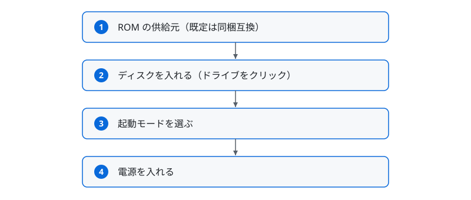

# WebM7 — FM-7 / FM77AV シリーズ Web Simulator

ブラウザ上で動く FM-7 / FM77AV シリーズ（FM-7 / FM-77 / FM77AV / FM77AV20 / FM77AV20EX / FM77AV40 / FM77AV40EX/SX）のシミュレータです。
GitHub Pages で動くページは https://7032jp.github.io/WebM7/ になります。

WebM7 は、ブラウザで FM-7 系の動作を体験し、対応ソフトウェアの開発・検証に利用できるシミュレータです。

**既定では、独立実装の互換 ROM セット [7032 Alternative ROMs](https://github.com/7032JP/7032AltROMs/tree/v1.0.9)（本体は MIT License。第三者素材由来の漢字字形は対象外。詳細は [LICENSE-AltROMs.md](LICENSE-AltROMs.md)）を同梱・使用するため、ROM ファイルを用意しなくても初回アクセスだけで起動できます。** お手持ちの ROM ファイルを使う場合は、ROM Files パネルの各 ROM 行にある供給元の選択で、必要な ROM だけを 1 本単位で「自分の ROM」に差し替えられます。
お手持ちの ROM は、ご自身が適法に所有する実機から取得したものをお使いください。

**ROMファイルの取り扱いについて / ROM File Handling**
- 本シミュレータが同梱・配信するのは、独立実装の互換 ROM セットのみです。純正 ROM は同梱も配信もしません。漢字系 ROM の字形の扱いは [LICENSE-Shinonome.md](LICENSE-Shinonome.md) を参照してください。
- 利用者がご用意された ROM ファイルは、ユーザーのブラウザ内（ローカル環境）でのみ処理します。ROMデータがサーバーに送信・保存されることはありません。
- By default this simulator bundles and uses an independently implemented compatible ROM set ([7032 Alternative ROMs](https://github.com/7032JP/7032AltROMs/tree/v1.0.9); the ROM set itself is under the MIT License, which does not cover third-party glyphs in the kanji ROM images). This project neither bundles nor distributes original ROM files. For the glyphs in the kanji ROM images, see [LICENSE-Shinonome.md](LICENSE-Shinonome.md).
- User-supplied ROM files are processed entirely within the user's browser (local environment). ROM data is never transmitted to or stored on any server.

※機種名・製品名は対応対象を示すために使用しています。本プロジェクトは各メーカーの承認を受けたものではありません。

> 開発者向け情報（ローカルでの起動方法・ソース構成など）は [HOWTO.md](HOWTO.md) を参照してください。

## 主な機能

### FM-7
- デュアル MC6809 CPU（メイン / サブ）
- 640×200 8色表示、TTLパレット
- PSG 音源（AY-3-8910）
- FDC（MB8877）、D77/2D ディスクイメージ対応
- CMT（カセットテープ）、T77 / WAV テープイメージの読み込み・保存対応
- キーボード入力（ASCIIモード、JIS 106/109配列対応、キーリピート対応）
- INS/CAPS/カナ LEDインジケーター
- カーソルキー → テンキー代替プリセット（テンキーレスキーボード対応）
- ジョイスティック（FM音源カード相当）

### FM-77
- FM-7 と同じ ROM 構成（BASIC ROM / 起動 ROM / サブシステム ROM）
- 3.5 インチ 2D フロッピーディスクドライブ内蔵（操作パネルの BASIC ボタンで起動モードを選択）

### FM77AV
- 320×200 4096色モード＋アナログパレット
- ALU ハードウェアアクセラレータ、ライン描画エンジン
- OPN FM 音源（YM2203: 3ch FM + SSG）
- VRAMダブルページ、CG ROMバンク切替
- 機種別の起動モードに対応
- サブROMバンク切替（Type-A/B/C）
- MMR/TWR（メモリ管理）
- スキャンコードキーボード

### FM77AV20
- FM77AV の全機能に加え、2DD フロッピーディスク対応

### FM77AV20EX
- FM77AV20 の全機能に加え、DMAC と高速MMRに対応

### FM77AV40
- 640×400 8色モード（400ライン表示）
- 320×200 262,144色モード
- 拡張RAM
- DMAC によるディスク転送に対応

### FM77AV40EX/SX
- FM77AV40 の全機能に加え、EXTSUB.ROM（拡張サブシステム Type-D/E）に対応
- サブROMバンク切替（Type-A/B/C/D/E）

### 共通機能
- ヘッダーの機種タブによる機種切り替え（選択はブラウザに保存）
- 機種別ハードウェアパネル（機種ごとの配色の操作パネル。電源・リセット・起動モード・ドライブの操作部）
- スキン切り替え（FM-7、FM77AV40EX。見た目のみ変更）
- 起動モード選択（BASIC / DOS）
- 表示倍率の切り替え（Web標準 / x2 / x1）とフルスクリーン（FULL）。幅の狭い画面やタッチ端末では倍率の選択は表示されず、自動調整になります
- ディスク / テープのライブラリ管理（ブラウザ内に複数イメージを保管・命名・挿入）
- 最近使ったディスク / テープの履歴（行をクリックするだけで再セット）
- ディスクの論理フォーマット（空ディスクを `SAVE` 可能にする）
- FDD動作音
- スクリーンショットPNG保存（640×400 で出力）
- ソフトウェアキーボード（タッチ端末で表示）
- キーカスタマイズ（物理キーボード種別の選択、FM-7キーへの物理キー割当、ブラウザ保存）
- Keyboard パネルのキーをクリックして入力（ソフトウェアキーボード。PC・タッチ共通）
- ROM Info（読み込み済みROMのサイズ・ハッシュ表示、クリップボードへコピー）

## 使い方

### 1. ROM の供給元を選ぶ（既定はそのままでOK）

WebM7 は**同梱の互換 ROM セットを常に土台**として動作し、そのうえで **ROM 1 本（スロット）ごとに供給元を選べます**。ROM Files パネルの各 ROM 行にある選択で「同梱互換」か「自分の ROM」を指定してください。たとえば `FBASIC30.ROM` だけ、あるいは `KANJI.ROM` だけをお手持ちのものにする、といった使い分けができます。指定はブラウザに保存され、次回以降も維持されます。現在どの組み合わせで動作しているかは、同じ ROM Files パネル上部の **ROM Set** 表示で確認できます。

- **同梱互換（既定）** — 独立実装の互換 ROM セット（本体は MIT License。第三者素材由来の漢字字形は対象外）を使用します。ROM ファイルの用意は不要で、初回アクセスだけで起動できます。漢字 ROM（KANJI.ROM・第1水準）も互換セットに同梱されており、漢字表示に対応しています。第2水準漢字 ROM（KANJI2.ROM）と辞書 ROM（DICROM.ROM）も同梱され、FM77AV40EX/SX で使われます。同梱の辞書 ROM は、かな漢字変換（日本語入力）には対応していません。漢字系 ROM の字形の扱いは [LICENSE-Shinonome.md](LICENSE-Shinonome.md) を参照してください。ソフトウェアの動作条件は、互換 ROM の互換性情報（[COMPATIBILITY.md](https://github.com/7032JP/7032AltROMs/blob/v1.0.9/docs/COMPATIBILITY.md)）を参照してください。
  - 同梱互換 ROM の BASIC は、プログラムをアスキー形式（`SAVE ,A` と同じ形式）だけで読み書きします。中間コード（バイナリ）形式で保存されたファイルは読み込めません（[COMPATIBILITY.md §3.2](https://github.com/7032JP/7032AltROMs/blob/v1.0.9/docs/COMPATIBILITY.md)）。お手持ちのプログラムファイルをそのまま使う場合は、`FBASIC30.ROM` の行を「自分の ROM」に切り替えてください。保護保存（`SAVE` の `,P` 指定）にも対応していません。機械語ファイル（`SAVEM` / `LOADM`）の形式は従来どおりです
- **自分の ROM** — お手持ちの ROM ファイルを読み込んで使用します（下記）。ROM ファイルを読み込むと、**その行だけ**自動的に「自分の ROM」へ切り替わります。まだファイルを読み込んでいない行では、選択肢が「自分の ROM（未登録）」と表示されます

供給元を選べる ROM は次の 12 本です。`FBASIC30.ROM` / `BOOT_DOS.ROM` / `BOOT_BAS.ROM` / `SUBSYS_C.ROM` / `KANJI.ROM` / `INITIATE.ROM` / `SUBSYS_A.ROM` / `SUBSYS_B.ROM` / `SUBSYSCG.ROM` / `EXTSUB.ROM` / `DICROM.ROM` / `KANJI2.ROM`（FM77AV 以降でのみ使う ROM の行は、その機種を選んでいるときに表示されます）。

供給元の切り替えは、シミュレータの停止中に行えます。

各行の状態は横のタグで分かります。

| 表示 | 意味 |
|---|---|
| `OK` | 「自分の ROM」を指定していて、ファイルも読み込み済み |
| `互換` | 「同梱互換」を指定（同梱の互換 ROM で動作） |
| `補完` | 「自分の ROM」を指定しているがファイルが未登録で、同梱互換 ROM で補って動作 |

**ROM Set** 表示は、同梱互換と自分の ROM の組み合わせと、補完中の件数を示します。混ざっているときと補完中は、この表示にマウスを重ねると該当する ROM を一覧で確認できます。

「自分の ROM」に指定した行のファイルがまだ読み込まれていない場合は、**その行だけ**同梱の互換 ROM で自動的に補って起動します。

選択した機種に合う ROM を指定してください。

**Clear ROMs** ボタンを押すと、ブラウザに保存した ROM を消去します（ディスクや Library はそのまま残ります）。供給元の指定もすべて「同梱互換」に戻ります。実行中に押したときは、電源を切った時点で切り替わります。

### 2. ROM ファイルを読み込む（「自分の ROM」に指定する行）

「自分の ROM」に指定した行には、以下の ROM ファイルを読み込みます（読み込んでいない行は同梱互換 ROM で補われます）。「同梱互換」のままにする行は、ファイルを用意する必要はありません。

表の「必須」は、画面のバッジと同じく、その機種の ROM 構成に含まれるという意味です。

#### FM-7 共通ROM

| ファイル名 | 内容 |
|---|---|
| `FBASIC30.ROM` | F-BASIC V3.0 ROM（本体搭載 ROM。起動に常に必須） |
| `BOOT_BAS.ROM` | BASIC ブート ROM（FM-7 系を起動モード BASIC で起動する場合に必須） |
| `BOOT_DOS.ROM` | DOS ブート ROM（FM-7 系を起動モード DOS で起動する場合に必須） |
| `SUBSYS_C.ROM` | サブシステム ROM（CGフォント内蔵）。起動に常に必須 |
| `KANJI.ROM`    | 漢字 ROM（JIS第一水準）。**任意**。漢字ROMカード相当で、指定すると漢字を使うソフトで漢字が表示されます |

#### FM77AV 追加ROM

FM77AV 系では、以下の 5 本がいずれも必須です。

| ファイル名 | 内容 |
|---|---|
| `INITIATE.ROM` | イニシエータROM。FM77AV 系の起動に必須（`BOOT_BAS.ROM` / `BOOT_DOS.ROM` は不要） |
| `KANJI.ROM`    | 漢字 ROM（JIS第一水準。FM-7 / FM-77 では任意） |
| `SUBSYSCG.ROM` | キャラクタージェネレータ ROM |
| `SUBSYS_A.ROM` | サブシステム Type-A ROM |
| `SUBSYS_B.ROM` | サブシステム Type-B ROM |

#### FM77AV40EX 追加ROM

| ファイル名 | 内容 |
|---|---|
| `EXTSUB.ROM` | 拡張サブシステムROM（Type-D/E、FM77AV40EX/SX で必須） |
| `DICROM.ROM` | 辞書 ROM（FM77AV40EX/SX で必須） |
| `KANJI2.ROM` | 漢字 ROM（JIS第二水準、FM77AV40EX/SX で必須） |

読み込み方法は2通りあります。

- **フォルダ指定** — 「Folder」で上記ファイルが入ったフォルダを選択
- **個別指定** — 各 ROM を1つずつファイル選択

各 ROM の横に「OK」と表示されれば読み込み成功です。
読み込み後、**ROM Info** を開くと各ROMのサイズとハッシュ値を確認できます。

### 3. メディアイメージをセットする（任意）

- **ディスク** — D77 / 2D 形式のディスクイメージを「Drive 0」「Drive 1」にセットできます。セットするとファイル名が表示されます
- **テープ** — T77 / WAV 形式のカセットテープイメージを「Tape Image」にセットできます。セットするとファイル名が表示されます
  - **WAV 形式**にも対応。実録音も読み込めます。読み込み時にデコード品質（正常ブロック数）を表示します
  - **REW** ボタンでテープを巻き戻し
  - テープ読み込み中（モーターON時）はシミュレータが自動的に高速化されます
  - BASIC で `SAVE` / `SAVEM` した内容は自動録音され、**録音→.t77** / **録音→.wav** ボタンでファイル保存できます
- **最近使ったファイル** — 一度セットしたディスク / テープは履歴に残り、次に「ファイルを選択」を押すと最近使ったファイルの一覧が先に開きます。行をクリックするだけで同じファイルを再セットでき、新しいファイルを選ぶときは「Choose a new file…」を押します（Drive 0 / 1 で共通の一覧。Library から挿入したものも含まれます）
  - ファイルへの参照を保持できるブラウザでは PC の最新のファイルを読み直します。それ以外のブラウザや、ファイルが移動・削除されていた場合は、開いた時点の控え（スナップショット）から復元します（WAV は控えを持たないため選び直しになります）
  - ページを開き直すと、前回ファイルからセットしていたディスクは、ファイルへの参照か控えが残っていれば「(saved — Power on to load)」と表示され、電源 ON で読み込まれます。Library から挿入していたディスクは、ページを開いた時点で挿入し直されます。テープは控えが残っていればそのまま戻ります
  - 履歴はディスク・テープそれぞれ 20 件まで。**Clear Disk Cache** ボタンで、ブラウザに保存したディスクイメージ・ファイル参照と履歴を消去できます（ROM と Library は残ります）

### 4. 起動

1. ヘッダーの**機種タブ**で機種を選択（FM77AV40EX タブは FM77AV40EX / FM77AV40SX を兼ねます）。機種ごとの機能差はタブの右に並ぶ能力バッジで確認できます
2. 機種別**ハードウェアパネル**で**起動モード**を選択（操作部の位置は機種・スキンによって変わります。下記「画面の構成」を参照）
   - **BASIC** — BASIC モードで起動します。ディスクイメージがセットされていればディスクから、なければ BASIC が起動します（同梱互換 ROM では [7T-BASIC](https://github.com/7032JP/7032AltROMs/blob/v1.0.9/docs/BASIC_REFERENCE.md)、お手持ちの BASIC ROM を指定した行ではその BASIC）。テープからのプログラム読み込み（`RUN ""`、`LOAD`、`LOADM`）やBASICプログラミングが可能です
   - **DOS** — DOS モードで起動します。起動可能なディスクイメージをセットしておいてください
3. ハードウェアパネルの**電源スイッチ**を押して起動
   - 起動に必要な ROM がまだ読み込まれていないときは、電源スイッチは淡色表示になり、押しても「ROMを設定してください」の案内が出ます
   - もう一度押すと停止します。**リセット**もハードウェアパネルにあります
   - 画面下のステータスバーの **Pause** で一時停止・再開、**📷** ボタンで画面を PNG ファイルとして保存、表示倍率トグル右端の **FULL**（または F11 キー）でフルスクリーン表示に切り替えできます

画面（Screen）をクリックするとキーボード入力がシミュレータに渡ります。

そのほかの設定は次のパネルにあります。

- **FM Sound Card**（FM-7 / FM-77 のみ表示） — Options パネル。チェックを入れるとFM音源カード（OPN）を有効にします（反映は次の電源投入・リセット時）
- **Mouse** / **Joystick 1** / **Joystick 2** / **Cursor → Ten Key** — Options パネル（下記「ジョイスティック」も参照）。**Cursor → Ten Key** をチェックすると、テンキーのないキーボードでもカーソルキー（↑↓←→）がテンキーの 8/2/4/6 として動作します
- **Drive Sound** — Disk Images パネル。チェックを入れるとフロッピーディスクの動作音が鳴ります。デフォルトはOFFです。ボリュームスライダーで音量調整できます

### 5. 画面の構成

画面はヘッダーと左右 2 カラムで構成されています。以下は広い画面の PC での構成です。幅の狭い画面やタッチ端末では配置が変わり、一部の表示が省かれます。

| 場所 | 内容 |
|---|---|
| ヘッダー | WebM7 ロゴ、機種タブ、スキン切り替え（対応機種のみ）、能力バッジと `RAM / VRAM` 容量表示、「機種比較」リンク |
| 左カラム | Screen（映像出力）、表示倍率トグル（Web標準 / x2 / x1 と、右端に FULL）、音量とステータスバー（Pause / 📷 を含む 2 段構成）、Debug Panels ボタン列、機種別ハードウェアパネル |
| 右カラム | Options / ROM Files / Library / Disk Images / Tape Image / BASIC Paste の各パネル |

#### スキン

FM-7 では **FM-7 / FM-NEW7**、FM77AV40EX では **FM77AV40EX / FM77AV40SX** のスキンを選べます。スキンで変わるのは見た目だけで、シミュレータの機能・動作は変わりません。選択は機種ごとにブラウザへ保存されます。

#### ハードウェアパネル

電源・リセット・起動モード・ドライブ（挿入状態・アクセスランプ・取り出し）の操作部です。FM-7（FM-7 / FM-NEW7 スキン）では画面下の上面帯（電源・リセット・起動モード）と画面右側の縦置きドライブユニット、そのほかの機種では画面下の横長バーとして表示されます。幅の狭い画面やタッチ端末では、FM-77 と FM77AV20 以降の機種の電源ボタンはバーの右側に表示されます。

| 機種（スキン） | 電源 | リセット | 起動モード |
|---|---|---|---|
| FM-7（FM-7 / FM-NEW7） | 上面帯 上段右端のロッカースイッチ | 上面帯 下段左端の丸ボタン（RESET） | 上面帯 下段右端の 4 連 DIP スイッチ。左端の BOOT レバーで BASIC / DOS を切り替え |
| FM-77 | バー左側の POWER ボタン | 前面下部のボタン列の RESET ボタン | 同じボタン列の BASIC ボタン（押し込み = BASIC、浮き = DOS） |
| FM77AV | バー右側の電源ボタン | 下部の帯の角型のリセットボタン | 下部の帯の「モード」の押しボタン（押すたびに BASIC / DOS が入れ替わる） |
| FM77AV20 / FM77AV40 / FM77AV20EX / FM77AV40EX / FM77AV40SX | バー左側の電源ボタン | 右列の「リセット」ボタン | 下部の帯の「モード」の押しボタン（押すたびに BASIC / DOS が入れ替わる） |

## キーボード

> キー配置の全体図、FM-7 固有のキー（BREAK / GRPH / カナ / HOME など）が日本語配列・英語配列のどのキーに当たるか、キーの割り当ての変え方は、**[キーボードマニュアル](docs/Keyboard_Manual.md)** に図入りでまとめています。

- **キー入力方式** — 押されたキーを**キーボード上の位置**で判定します。日本語配列（JIS 106/109）・英語配列（ASCII / US 101/104）のどちらでも、同じ場所のキーが同じ FM-7 キーになります
- **クリックで入力（ソフトウェアキーボード）** — Keyboard パネル（ツールバー2行目の **Keyboard** ボタン）のキーボード図のキーをクリックすると、その文字がシミュレータに入力されます（テンキーの `=` と EL / CLS / DUP は入力に対応していません）。Shift と CTR はスティッキー（次のキーを押して離すと戻ります。CTR は入力コードの無いキーでは戻りません）、GRPH は押している間のみ、CAP / カナ はトグル動作です。タッチ端末では画面下部のソフトウェアキーボードでも同様に入力できます
- **キーカスタマイズ** — Keyboard パネルの「キーカスタマイズ」で、お使いの物理キーボードを **配列**（日本語配列 / 英語配列）と **種別**（フルキー / テンキーレス / コンパクト）で選択できます。「カスタマイズ開始」を押し、割り当てたい FM-7 キーをクリックしてから物理キーを押すと、そのキーが割り当てられます。割当はブラウザに保存され、「リセット」で既定に戻せます。FM-7 / FM77AV 共通の設定です
- **英語配列向けの代替入力** — `_` キーが無い配列では `Ctrl + /` で `_` を入力できます（`@` は P の右の `[` キーにそのまま割り当たっています）
- **機種によるキー構成の違い** — **無変換** / **変換** キーは FM77AV 以降でのみ表示されます（FM-7 / FM-77 では非表示で、SPACE キーがその分広くなります）

## スマートフォン / タブレット

タッチ端末では画面下部にソフトウェアキーボードを表示します。**縦向きのスマートフォン**では、カーソルキー・編集キー・テンキーをメインキーの下段にまとめた縦長専用レイアウトへ自動で切り替わります。ソフトウェアキーボードは画面のすぐ下にドック表示されます。

## ジョイスティック

PCのゲームパッドを接続すると、FM-7/FM77AV のジョイスティックとして使用できます。FM-7 / FM-77 では、Options パネルの **FM Sound Card** を有効にしてから電源投入 / リセットしてください。

- **ポート選択** — Options パネルの **Joystick 1**（ポート 1）/ **Joystick 2**（ポート 2）で、接続中のゲームパッドをそれぞれ割り当て
- **ボタン割り当て** — 左スティック / D-pad = 方向、A/X = トリガー1、B/Y = トリガー2
- **2P対応** — 2 つ目のゲームパッドは、もう一方のプルダウンで選ぶと 2P 側として使えます（自動では割り当てられません）

## 対応ブラウザ

以下のブラウザで動作確認しています。

- Firefox（Windows）
- Google Chrome（Windows/macOS）
- Microsoft Edge（Windows）
- Safari（macOS/iPad）

## 不具合の報告

不具合は本リポジトリの [Issue](https://github.com/7032JP/WebM7/issues) へお願いします。同梱互換 ROM の内容（BASIC の動作・起動 ROM・サブシステム）に関することは、配布元の [Issue](https://github.com/7032JP/7032AltROMs/issues) が窓口です。

## ライセンス

[MIT License](LICENSE) © 2026 [7032](https://x.com/7032) / Naomitsu Tsugiiwa

本ライセンスは WebM7 自体の成果物（JavaScript, HTML, CSS のソースコードのほか、本プロジェクトが作成したドキュメント・図・アイコン・テクスチャ等を含みます）に適用されます。第三者に権利が帰属する要素（各社ブランドロゴなど）には適用されません。適用範囲と注記の詳細は [LICENSE-MIT.md](LICENSE-MIT.md) を参照してください。

配布物に含まれる第三者のコード・素材には、それぞれ別のライセンスが適用されます。区分の一覧は [LICENSE-MIT.md](LICENSE-MIT.md) の「ライセンスの案内」の表にあり、詳細は次の各文書を参照してください。

- FM 音源の FM 合成部（core/opn.js の一部）は "FM Sound Generator" (fmgen) Copyright (C) by cisc 1998, 2003 の移植で、原典の利用条件が適用されます（原文は core/fmgen_readme.txt を同梱）。詳細は [LICENSE-fmgen.md](LICENSE-fmgen.md)。
- 同梱の互換 ROM セット（`assets/altroms/`）の条件は、同梱の `assets/altroms/LICENSE` に従います。詳細は [LICENSE-AltROMs.md](LICENSE-AltROMs.md)。
- 互換 ROM セットの漢字系 ROM に含まれる第三者素材由来の字形は MIT License の対象外です。詳細は [LICENSE-Shinonome.md](LICENSE-Shinonome.md)。

同梱の互換 ROM セット（本体は MIT License）は本プロジェクトとは別の配布物 [7032 Alternative ROMs](https://github.com/7032JP/7032AltROMs/tree/v1.0.9) で、ソースと文書はそちらにあります。配布物には ROM 本体と併せて LICENSE / LICENSE-MIT.md / LICENSE-FONT.md / docs/LEGAL.md / SHA256SUMS / README.md（`assets/altroms/`）を同梱しています。ファイルの検証手順は [LICENSE-AltROMs.md](LICENSE-AltROMs.md) を参照してください。
