# WebM7 ヘッドレステスト マニュアル

WebM7 のシミュレータコアは、ブラウザなしで **Node.js から直接** 動かせます。

この仕組みを使うと、次のような自動テストが書けます。

- ディスクや BASIC プログラムを起動し、一定フレーム後の状態（CPU レジスタ・メモリ・VRAM）を検査する
- 任意のフレームの画面を画像（PPM）として書き出し、表示結果を目視・差分比較する
- キー入力を流し込んで操作を再現し、期待した動作になるか確かめる

本書は、その書き方とコア API をまとめたものです。

---

## 1. ヘッドレスとは

「ヘッドレス（headless）」とは、**画面（head）なしでプログラムを動かすこと**です。WebM7 は本来ブラウザで動くシミュレータですが、ブラウザの代わりに Node.js でシミュレータコア（`core/`）だけを動かすことができます。

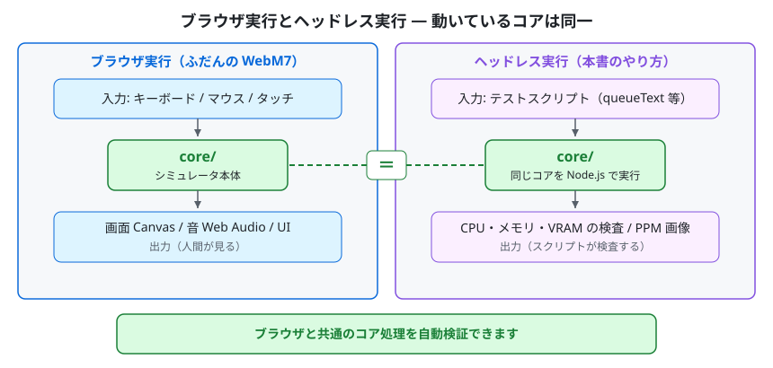

入力と出力をブラウザからテストスクリプトに置き換えるだけで、中で動くシミュレータ本体（`core/`）は同一です。

ヘッドレステストで、ブラウザと共通のコア処理を検証できます。ブラウザ固有の入出力はブラウザで確認してください（第10章参照）。

テスト 1 本の全体の流れは次のとおりです。

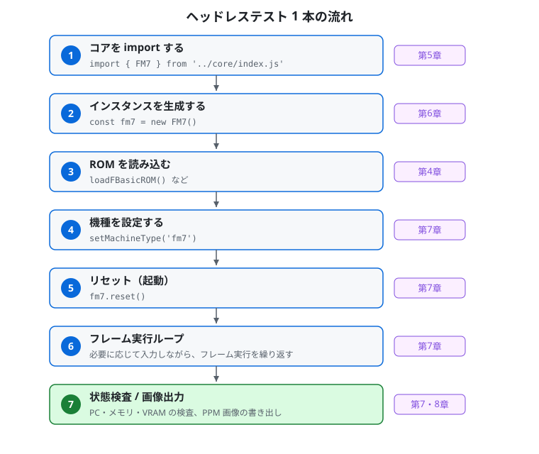

コアの読み込みから状態検査まで 7 ステップ。各ステップの詳細は右側に示した章で説明します。

---

## 2. 前提環境

- **Node.js**（ES Modules 対応。v22 以降の LTS を推奨）
- WebM7 のソース一式（`core/` ディレクトリ。エンジン部だけを読み込みます）
- 同梱の互換 ROM イメージ、またはご自身で用意した ROM イメージ（第4章）
- 必要に応じてディスクイメージ（`.d77` など）やテープイメージ（`.t77` / `.wav`）

WebM7 のコアは ES Modules (`import`) で書かれています。テストスクリプトの拡張子は **`.mjs`** とすれば、Node.js がそれを ES Module として実行します（`package.json` などの追加設定は不要です）。

---

## 3. セットアップ（clone からテスト実行まで）

### 3.1 リポジトリを clone する

```bash
git clone https://github.com/7032JP/WebM7.git
cd WebM7
```

clone 直後のディレクトリ構成は次のとおりです。シミュレータコア `core/` がそのまま含まれており、これがヘッドレステストの実行対象になります。

```
WebM7/
├── core/                  ← 共有エンジン（テストはここを読み込む）
│   ├── index.js           公開 API の窓口（FM7 / 機種定数を再エクスポート）
│   └── …                  エンジン部とブラウザ結合部（ブラウザ結合部はヘッドレスでは読み込みません）
├── assets/
│   └── altroms/           同梱の互換 ROM セット
├── docs/                  ドキュメント（本書を含む）
├── index.html             ブラウザのメイン画面・UI
└── …
```

> ヘッドレステストでは `core/` のエンジン部を読み込みます。ROM と必要なメディアイメージは第4章の手順で指定してください。テスト用のディレクトリやスクリプトは含まれていませんので、下記のとおり**ご自身で作成**します。

### 3.2 テスト用ディレクトリを作る

`core/` を相対パス `../core/` から読み込めるよう、リポジトリ直下に作業用ディレクトリ（例: `test/`）を作り、その中に `.mjs` を置きます。

```bash
mkdir test
# test/your_test.mjs を作成（中身は第6章の最小サンプルを参照）
```

```
WebM7/
├── core/
│   └── index.js …
└── test/                  ← 自分で作る
    └── your_test.mjs      ← ここにテストを書く（../core/ を読み込む）
```

スクリプト内では次のようにコアを読み込みます（公開窓口の `index.js` 経由が便利です）。

```javascript
const { FM7 } = await import('../core/index.js');
```

### 3.3 実行する

リポジトリルート（`WebM7/`）から実行します。

```bash
node test/your_test.mjs
# もしくは
cd test && node your_test.mjs
```

> ディスクイメージは clone した中には含まれません。ROM は第4章を参照してください。パスはスクリプト内で各自の環境に合わせて指定します。

---

## 4. ROM の用意

シミュレータの起動には ROM イメージが必要です。WebM7 には独立実装の互換 ROM セット（本体は MIT License。第三者素材由来の漢字字形は対象外）を `assets/altroms/` に同梱しており、漢字系 ROM（漢字 ROM `kanji.rom` / `kanji2.rom`・辞書 ROM `dicrom.rom`）を含む基本 ROM はそのまま使えます。純正 ROM は同梱・配信しません。**互換 ROM セットに含まれない ROM を使う場合は、ご自身で適法に用意し、任意のフォルダに置いてください。**テストスクリプトでは、そのフォルダを定数にして読み込みます。漢字系 ROM の字形の条件は `LICENSE-Shinonome.md` を参照してください。

必要な ROM は機種により異なります。読み込みメソッドと、本書のサンプルコードで使う**ファイル名の例**は次のとおりです（ファイル名は各自の ROM に合わせてください。同梱互換 ROM の BASIC は `7tbasic3.rom` です）。

| 区分 | 読み込みメソッド | サンプルでの名前例 | サイズの目安 | 主な対象機種 |
|---|---|---|---|---|
| BASIC ROM | `loadFBasicROM()` | `7tbasic3.rom`（同梱の 7T-BASIC） | 約 31KB | 全機種（常に必須。本体搭載 BASIC ROM に対応） |
| DOS ブート ROM | `loadBootROM()` | `boot_dos.rom` | 512 バイト | FM-7 系（Boot Mode: DOS で必須） |
| BASIC ブート ROM | `loadBootBasROM()` | `boot_bas.rom` | 512 バイト | FM-7 系（Boot Mode: BASIC で必須） |
| サブシステム ROM (Type-C) | `loadSubROM()` | `subsys_c.rom` | 約 10KB | 全機種（常に必須。サブ CPU 用） |
| イニシエータ ROM | `loadInitiateROM()` | `initiate.rom` | 8KB | FM77AV 系（必須） |
| サブシステム ROM (Type-A) | `loadSubROM_A()` | `subsys_a.rom` | 8KB | FM77AV 系（必須） |
| サブシステム ROM (Type-B) | `loadSubROM_B()` | `subsys_b.rom` | 8KB | FM77AV 系（必須） |
| CG ROM | `loadCGROM()` | `subsyscg.rom` | 最大 8KB | FM77AV 系（必須） |
| 漢字 ROM（第1水準） | `loadKanjiROM()` | `kanji.rom` | 128KB | FM-7 系では任意（漢字表示用）、FM77AV 系では必須 |
| 漢字 ROM（第2水準） | `loadKanji2ROM()` | `kanji2.rom` | 128KB | FM77AV40EX/SX（必須） |
| 辞書 ROM | `loadDicromROM()` | `dicrom.rom` | 256KB | FM77AV40EX/SX（必須） |
| 拡張サブ ROM | `loadExtSubROM()` | `extsub.rom` | 48KB | FM77AV40EX/SX（必須） |

表の「必須」は、その機種の ROM 構成に含まれるという意味です（ブラウザの WebM7 の ROM Files パネルのバッジと同じ区分です）。

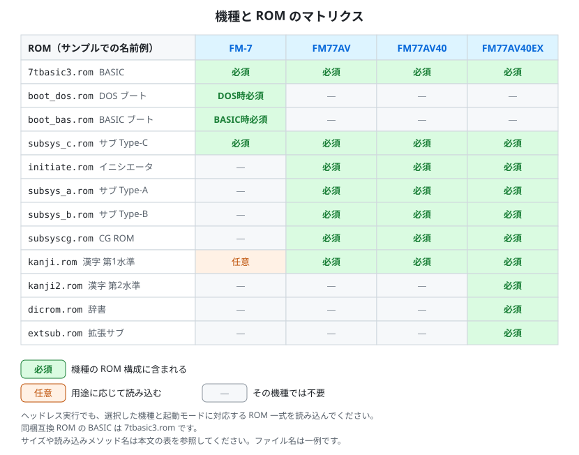

機種ごとの ROM を色分けしたマトリクスです。緑が機種の ROM 構成に含まれる ROM（必須）です。橙は任意の ROM、「―」はその機種では不要な ROM です。

> ヘッドレス実行でも、選択した機種と起動モードに対応する ROM 一式を読み込んでください。

> ROM 読み込みメソッドはいずれも `ArrayBuffer`（または `Uint8Array.buffer`）を引数に取ります。`readFileSync()` で読んだバッファをそのまま渡せます。

### 4.1 素材の置き場所

ROM やディスクイメージの置き場所は、スクリプトに絶対パスで書き込まず、環境変数などで指定できるようにしておくと、環境が変わってもテストを書き換えずに済みます（第6章のサンプルの `WEBM7_ROM_DIR` を参照）。

---

## 5. ブラウザ API スタブは不要

コアのエンジン部はブラウザのグローバル（`document` / `window` / `AudioContext` / `requestAnimationFrame` 等）を参照しないため、**スタブを置く前処理は不要**です。`import` 文をファイル先頭に書いて構いません。

```javascript
import { FM7 } from '../core/index.js';
```

---

## 6. 最小サンプル

FM-7 として起動し、フレームを回して BASIC のプロンプトまで進め、CPU の状態を表示する最小例です。このまま写して動かせます（ROM のパスとファイル名だけ各自の環境に合わせてください）。

```javascript
#!/usr/bin/env node
import { readFileSync } from 'fs';

// --- 1) コア読み込み（公開窓口の index.js 経由。スタブは不要） ---
import { FM7 } from '../core/index.js';

// --- 2) ROM フォルダ（各自のパスに置き換える） ---
const ROM_DIR = process.env.WEBM7_ROM_DIR || './roms';
const rom = (name) => new Uint8Array(readFileSync(`${ROM_DIR}/${name}`));

// --- 3) インスタンス生成・ROM 読み込み・機種設定 ---
const fm7 = new FM7();
fm7.loadFBasicROM(rom('7tbasic3.rom'));   // ファイル名は各自の用意したものに合わせる
fm7.loadBootROM(rom('boot_dos.rom'));
fm7.loadBootBasROM(rom('boot_bas.rom'));
fm7.loadSubROM(rom('subsys_c.rom'));
fm7.setMachineType('fm7');                // 'fm7' | 'fm77' | 'fm77av' | 'fm77av20' | 'fm77av20ex' | 'fm77av40' | 'fm77av40ex'

// --- 4) ディスク挿入（任意。ディスクなしなら ROM BASIC が起動します） ---
// const disk = readFileSync('./disk.d77');
// fm7.fdc.loadDisk(0, new Uint8Array(disk).buffer);   // ドライブ 0 に挿入

// --- 5) リセットして起動 ---
fm7.reset();

// --- 6) exec 1 回 = 16667 マイクロ秒（約 1/60 秒）を 1 フレームと数え、600 フレーム実行して起動を待つ ---
const FRAME_US = 16667;
const runFrames = (n) => { for (let i = 0; i < n; i++) fm7.scheduler.exec(FRAME_US); };
runFrames(600);

// --- 7) キー入力を流し込む（BASIC のプロンプト到達後） ---
fm7.keyboard.queueText('PRINT 123\n');
while (fm7.keyboard.autoTypePending) runFrames(1);
runFrames(60);   // 最後のキーが処理されるまで少し余分に回す

// --- 8) 状態を表示 ---
console.log(`Main PC = $${fm7.mainCPU.pc.toString(16)}`);
console.log(`Sub  PC = $${fm7.subCPU.pc.toString(16)}`);
```

---

## 7. コア API リファレンス

### 7.1 生成・リセット

```javascript
const fm7 = new FM7();
fm7.setMachineType('fm77av');   // 機種を設定（ROM 読み込み後・reset 前に）
fm7.reset();                    // 全システムリセット。起動経路は機種とブートモードで決まる（7.1.1 節）
```

`setMachineType` が受け付ける機種の文字列（これ以外の文字列は `'fm7'` として扱います）:

| 文字列 | 機種 | `core/index.js` から re-export される定数 |
|---|---|---|
| `'fm7'` | FM-7 | `MACHINE_FM7` |
| `'fm77'` | FM-77 | `MACHINE_FM77` |
| `'fm77av'` | FM77AV | `MACHINE_FM77AV` |
| `'fm77av20'` | FM77AV20 | `MACHINE_FM77AV20` |
| `'fm77av20ex'` | FM77AV20EX | `MACHINE_FM77AV20EX` |
| `'fm77av40'` | FM77AV40 | `MACHINE_FM77AV40` |
| `'fm77av40ex'` | FM77AV40EX/SX | `MACHINE_FM77AV40EX` |

#### 7.1.1 起動経路の指定（ブートモード）

`reset()` が選ぶ起動経路は、機種と **ブートモード**（`'basic'` / `'dos'`）で決まります。ブラウザで機種別ハードウェアパネルから選ぶ起動モードに相当する設定は、ヘッドレスでは次のフィールドで行います（`reset()` の**前**に設定）。

```javascript
fm7._bootModeOverride = 'basic';   // 'basic' または 'dos'
fm7._bootModeExplicit = true;      // 明示選択（FM77AV 系でもこの値を優先させる）
fm7.reset();
```

| 機種 | ブートモード | 起動経路 |
|---|---|---|
| FM-7 系 | `'basic'` | BASIC ブート ROM（`loadBootBasROM()`）を実行します。 |
| FM-7 系 | `'dos'` | DOS ブート ROM（`loadBootROM()`）を実行します。 |
| FM77AV 系 | どちらでも | イニシエータ ROM（`loadInitiateROM()`）を実行します。`_bootModeExplicit` を `true` にしない場合は、ドライブ 0 にディスクがあれば `'dos'`、無ければ `'basic'` として扱われます。 |

### 7.2 実行（時間を進める）

スケジューラにマイクロ秒を渡して、その分だけエミュレーションを進めます。

```javascript
fm7.scheduler.exec(16667);   // およそ 16,667 マイクロ秒（約 1/60 秒）進める
fm7.scheduler.step();        // メイン CPU を 1 命令だけ実行（戻り値 = 消費サイクル数）
```

FM-7 系・FM77AV 系のいずれも、メイン CPU とサブ CPU の 2 つの MC6809 を持つデュアル CPU 構成です。スケジューラが両者の同期を保ちながら進めるため、テスト側は `exec()` を呼ぶだけでかまいません。

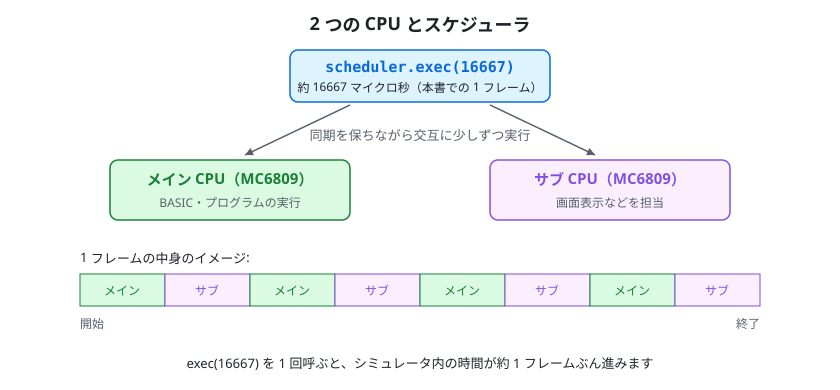

`exec(16667)` を 1 回呼ぶと、シミュレータ内の時間がおよそ 16,667 マイクロ秒（約 1/60 秒）ぶん進みます（命令の区切りで止まるため、ちょうどにはなりません）。本書ではこの 1 回ぶんを便宜上「1 フレーム」と呼びます。画面の更新周期は表示モードで異なるため、この単位と画面の更新は 1 対 1 に対応しません。

複数フレームを回すヘルパー例:

```javascript
const runFrames = (n) => { for (let i = 0; i < n; i++) fm7.scheduler.exec(16667); };
runFrames(300);
```

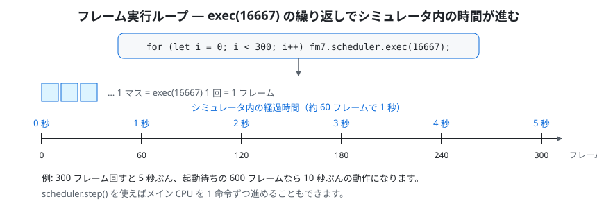

`exec(16667)` を繰り返すほど実機時間が進みます。60 フレームで実機の約 1 秒、300 フレームで約 5 秒ぶんです。

### 7.3 ディスク

```javascript
fm7.fdc.loadDisk(driveNum, arrayBuffer);   // driveNum: 0〜3、D77/2D/2DD/HFE を自動判別
fm7.fdc.selectDisk(driveNum, diskIdx);     // 連結された複数ディスクから選択
```

`loadDisk` には `ArrayBuffer` を渡します（`new Uint8Array(buf).buffer`）。

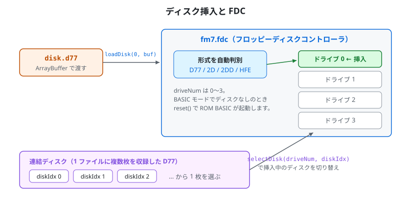

`loadDisk` で渡したイメージは形式（D77 / 2D / 2DD / HFE）が自動判別されて指定ドライブに入ります。複数枚を連結した D77 では `selectDisk` で挿入中の 1 枚を切り替えます。

### 7.4 キー入力

**(a) テキスト自動入力 `queueText`（推奨）**

```javascript
fm7.keyboard.queueText('LOAD"PROG"\n', { charGap: 2, lineGap: 12 });
```

- `\n` は RETURN として扱われます
- `charGap` … 通常キー間の間隔（フレーム数。既定 2）
- `lineGap` … RETURN 後の間隔（フレーム数。既定 12。BASIC が前の行を処理する時間を確保します）

`queueText` はキューに文字を積みます。送出はスケジューラが自動で行うため、**テスト側は `scheduler.exec(16667)` を繰り返し呼ぶだけ**でキーが順に送られます。

前のキーが読み取られ、指定の間隔（`charGap` / `lineGap`）が経つまでは、次のキーを送りません。

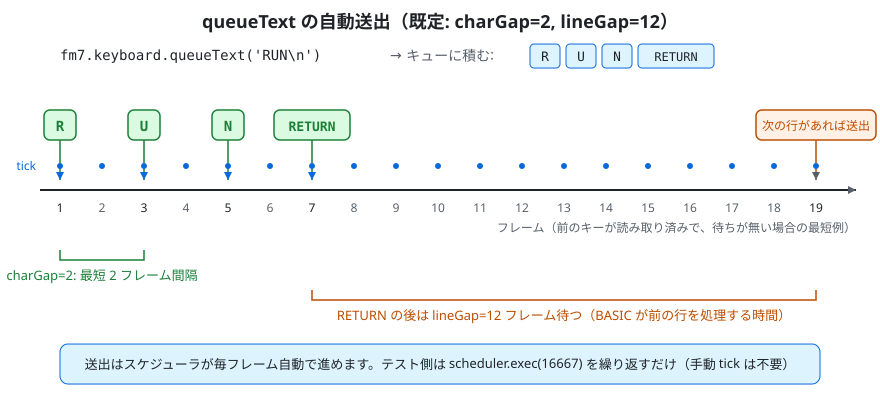

通常は既定値（`charGap: 2` / `lineGap: 12`）のままで構いません。極端に短くするとキーを取りこぼすことがあります。

送出が終わったかどうかは `autoTypePending` で確認できます。

```javascript
fm7.keyboard.queueText('FILES\n');
while (fm7.keyboard.autoTypePending) fm7.scheduler.exec(16667);
runFrames(60);   // 最後のキーが BASIC に処理されるまで少し余分に回す
```

- `autoTypePending` … 送出待ちのキーが残っていれば真
- `clearAutoType()` … 送出待ちのキューを破棄する
- `autoTypeTick(elapsedUs, canRelease = true)` … オートタイプを手動で進める低レベルメソッド。スケジューラが自動で呼ぶため通常は不要です（追加で呼ぶと送出ペースがその分速まります）。第 2 引数を偽にすると、その回は送出しません

なお、起動直後など**入力受付前に送ると取りこぼす**ことがあるため、BASIC の `Ready` プロンプト到達を待ってから送ってください（先にフレームを十分回しておきます）。

**(b) 単発キーコード送出 `_pushKey`（低レベル API・上級者向け）**

```javascript
fm7.keyboard._pushKey(0x0D);   // RETURN（カーソルキーやファンクションキー等の単発送出に）
```

`_pushKey` はハードウェアのキーバッファへ **FM-7 のキーコード** を 1 つ直接積みます。コードの解釈は現在のキーボードモード（FM-7 の ASCII モード / FM77AV 系のスキャンコードモード）に依存し、スキャンコードモードではビット 7 を立てるとブレイク（離す）コードになります。送出ペースの調整や BASIC 側の受付待ちは一切行われないため、**文字列やコマンドの入力には向きません**。通常のテキスト入力には `queueText` を使ってください。

### 7.5 ジョイスティック入力

ヘッドレスでは、プログラムから方向・トリガを直接与えるための公開 API を使います。

**(a) 状態の設定 `setJoystickState`（推奨）**

```javascript
// 名前付きで指定（押しているものだけ true。省略したものは離した扱い）
fm7.setJoystickState(0, { right: true, trigger1: true });   // ポート1: 右＋トリガ1

// 生バイト（active-low: 0xFF＝全解放）でも指定可
fm7.setJoystickState(0, 0xF7);   // bit3(右)だけ 0 ＝右
```

- 第1引数 … FM ポート（`0`＝ジョイスティック1、`1`＝ジョイスティック2）
- 第2引数 … 次のフィールドを持つオブジェクト、または active-low の生バイト

| フィールド | ビット | 生バイト（そのボタンだけ押下時） |
|---|---|---|
| `up` | bit0 | `0xFE` |
| `down` | bit1 | `0xFD` |
| `left` | bit2 | `0xFB` |
| `right` | bit3 | `0xF7` |
| `trigger1` | bit4 | `0xEF` |
| `trigger2` | bit5 | `0xDF` |

押している状態は、次に変更するまで保持されます。`reset()` では全解放に戻ります。FM-7 / FM-77 では FM 音源カードが既定で無効のため、先に `fm7.setFMCard(true)` で有効にしてください（FM77AV 系では常に有効です）。

**(b) 解放 `clearJoystickState`**

```javascript
fm7.clearJoystickState(0);   // ポート1を全解放（0xFF）へ
fm7.clearJoystickState();    // 引数省略で両ポートを解放
```

入力を与えたら、対象プログラムが読み取れるよう `scheduler.exec(16667)` でフレームを進めてください。押しっぱなし・離しの表現は、設定→数フレーム実行→解放、の順で書けます。

```javascript
fm7.setJoystickState(0, { trigger1: true });   // 押す
runFrames(3);                                  // 数フレーム保持
fm7.clearJoystickState(0);                      // 離す
runFrames(3);
```

### 7.6 状態の参照（検査用）

| プロパティ | 内容 |
|---|---|
| `fm7.mainCPU.pc` | メイン CPU プログラムカウンタ |
| `fm7.subCPU.pc` | サブ CPU プログラムカウンタ |
| `fm7.mainRAM` | メイン RAM（`Uint8Array`） |
| `fm7.display.vram` | VRAM（`Uint8Array`） |
| `fm7.display.displayMode` | 表示モード |
| `fm7.display.crtOn` | CRT 出力の有効フラグ |
| `fm7.scheduler.mainCyclesTotal` | 実行済みメイン CPU サイクル総数 |

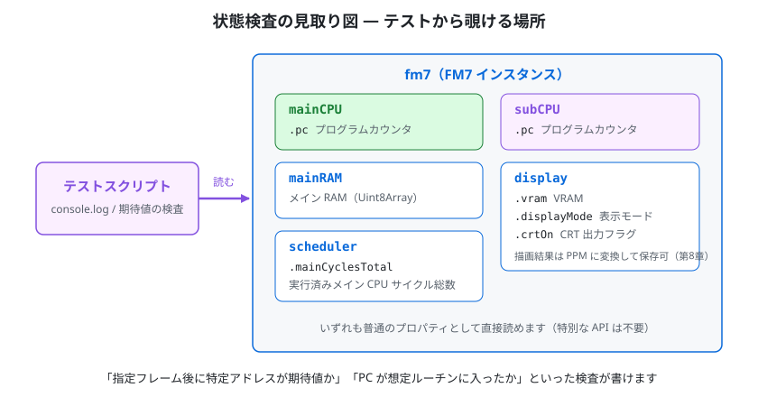

`fm7` インスタンスの中の CPU・メモリ・VRAM などを、テストスクリプトから普通のプロパティとして直接読めます。

メモリやレジスタ、VRAM を直接読めるので、「指定フレーム後に特定アドレスが期待値か」「PC が想定ルーチンに入ったか」といった検査が書けます。

---

## 8. 画面のキャプチャ（PPM 出力）

`display.render()` は画面を RGBA のフレームバッファ（`display.frame`）へ描きます。Canvas のシムを用意する必要はありません。受け取った RGB を **PPM (P6)** として書き出すと、画像ビューア（ImageMagick・GIMP 等）で確認できます。

流れは次のとおりです。

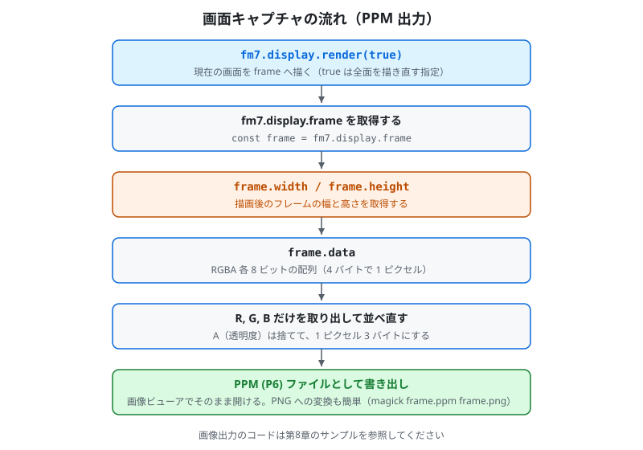

`render(true)` で現在の画面を描画し、`display.frame` の `width` / `height` / `data`（RGBA、左上から順）を読み出して PPM (P6) に変換します。

```javascript
import { writeFileSync } from 'fs';

function savePPM(fm7, path) {
    fm7.display.render(true);                  // 引数 true = 全面を描き直す指定
    const img = fm7.display.frame;             // { width, height, data: Uint8ClampedArray (RGBA) }
    const W = img.width, H = img.height;       // サイズは frame から取るのが確実
    const header = `P6\n${W} ${H}\n255\n`;
    const buf = Buffer.alloc(header.length + W * H * 3);
    buf.write(header, 0);
    let off = header.length;
    const data = img.data;
    for (let i = 0; i < W * H; i++) {
        buf[off++] = data[i * 4];      // R
        buf[off++] = data[i * 4 + 1];  // G
        buf[off++] = data[i * 4 + 2];  // B
    }
    writeFileSync(path, buf);
}

// 使用例
runFrames(180);
savePPM(fm7, './frame_180.ppm');
```

> 出力先は任意です。`test/out/` のように作業ディレクトリ内へまとめると整理しやすいです。PPM はそのままでも開けますが、`magick frame.ppm frame.png` などで PNG に変換すると扱いやすくなります。

書き出される PPM (P6) ファイルの中身は、次のような単純な構造です。

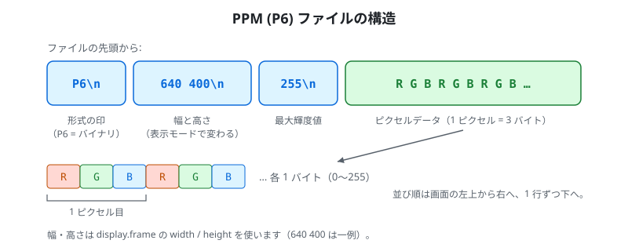

テキストのヘッダ 3 行（形式 `P6`・幅と高さ・最大輝度値 255）の後に、1 ピクセル 3 バイトの RGB データが左上から順に並びます。

---

## 9. テープ（参考）

```javascript
fm7.cmt.loadT77(new Uint8Array(readFileSync('./tape.t77')).buffer);   // T77 形式
fm7.cmt.loadWAV(new Uint8Array(readFileSync('./tape.wav')).buffer);   // WAV 形式
```

その後 BASIC 側で `RUN"CAS:"` / `LOAD"CAS:"` / `LOADM"CAS:",,R` 等を `queueText` で送り、フレームを進めて読み込ませます。

> **既知の制約** … ヘッドレス実行ではテープ LOAD が完了しない場合があります。テープの動作確認はブラウザで行ってください。SAVE の自動テストは利用できます。

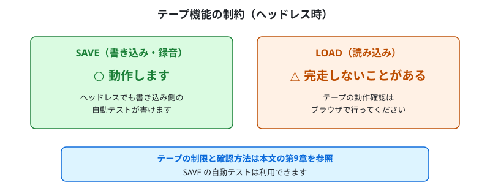

図は、テープ機能の確認方法をまとめたものです。

---

## 10. 既知の制約・注意点

- **ブラウザ結合部は読み込まない** … `core/index.js` が公開するのはエンジン部だけです。ブラウザ結合部（`fm7_browser.js` など）はブラウザ専用で、Node.js では動きません。ヘッドレス実行では `core/index.js` を読み込んでください。
- **`setMachineType` → `reset` の順** … ROM を読み込み、`setMachineType` で機種を設定してから `reset()` します。起動経路は機種とブートモードで決まります（7.1.1 節）。
- **テープの動作確認** … 制限と確認方法は第9章を参照してください。
- **オートタイプは受付開始を待ってから** … 入力受付前に送ると取りこぼすことがあります。BASIC の `Ready` プロンプト到達を待ってから送ってください。
- **画面サイズは表示モードで変わる** … 幅・高さは `render()` 後に確定します。PPM 書き出しは `display.frame` の `width` / `height` を使ってください（第8章のサンプルはそうなっています）。

---

## 11. テストのひな型として

新しいテストを書くときは、本書の構成をそのままひな型にできます。

1. **第6章の最小サンプル**のセットアップ部（生成 → ROM 読み込み → `setMachineType` → `reset`）を流用する
2. 検証したい内容に応じて、**第7章の状態参照**（メモリ・レジスタ・VRAM）や**第8章の PPM 出力**を組み合わせる

セットアップは毎回ほぼ同じです。自分用の共通ヘルパー（例: `test/harness.mjs`）に切り出して `import` すると、各テストが短く書けます。

---

## まとめ

1. `core/index.js` から `FM7` を読み込む（スタブは不要）
2. `FM7` を生成し、ROM 読み込み → `setMachineType` → `reset`
3. `scheduler.exec(16667)` でフレームを進める
4. メモリ・レジスタ・VRAM を読んで検査、または `display.frame` から PPM 画像を書き出す
5. キー入力は `queueText` で積み、フレームを回して自動送出させる

これだけで、ブラウザを開かずに WebM7 の動作を自動検証できます。
