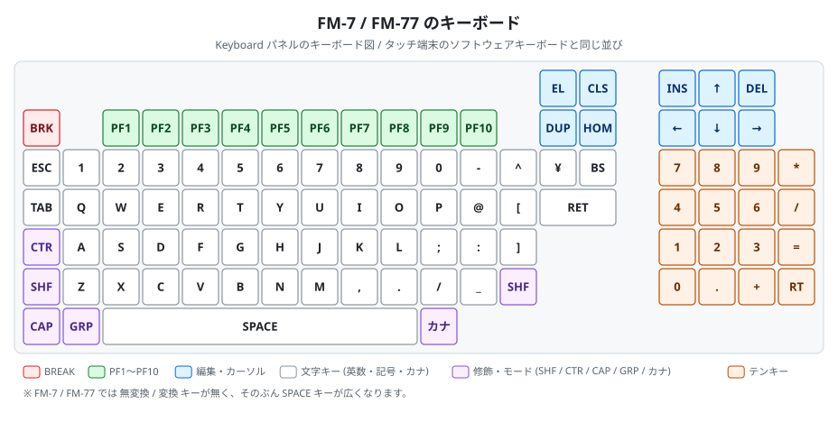
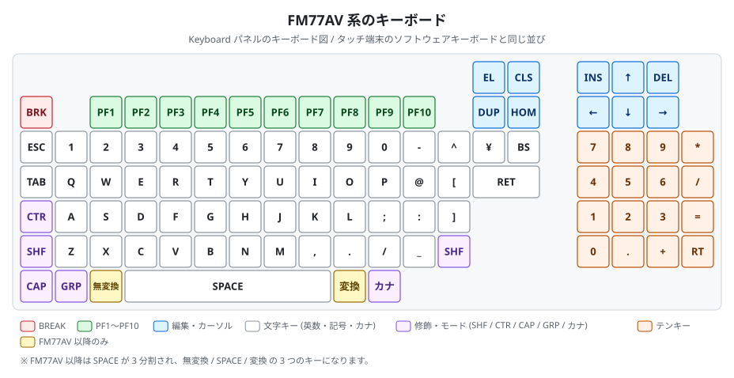
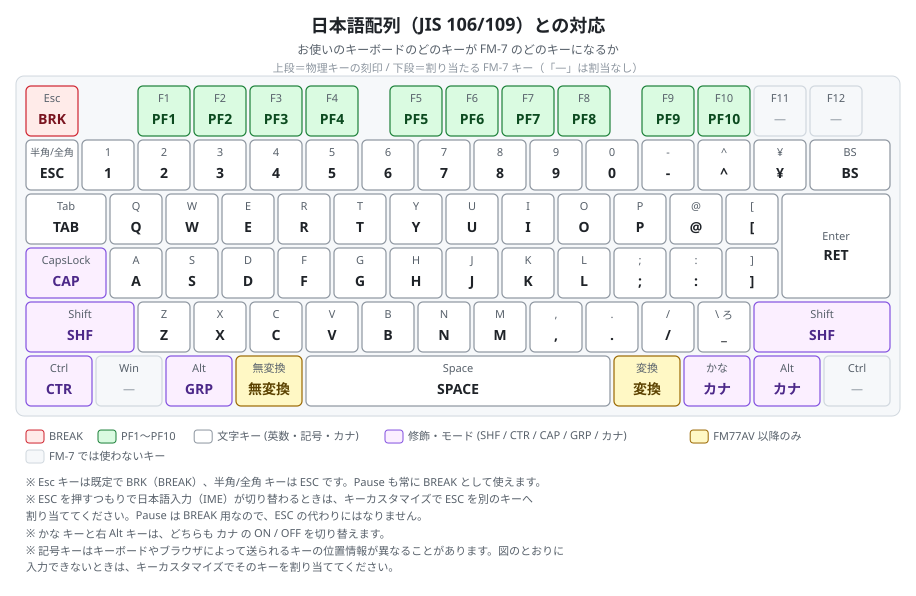
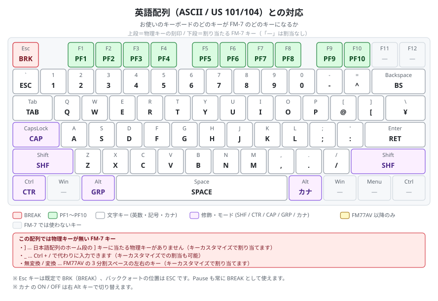
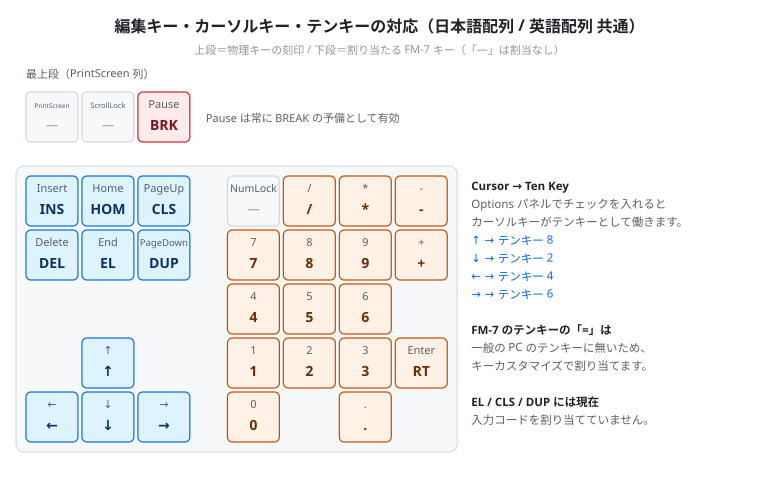
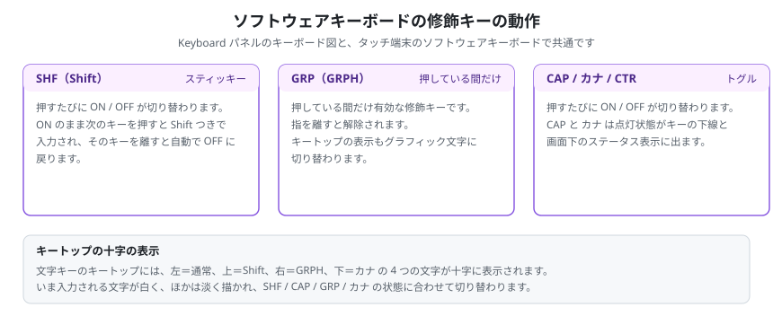
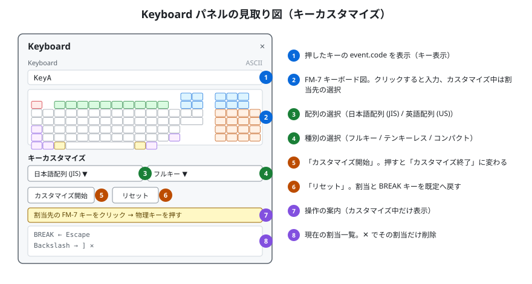
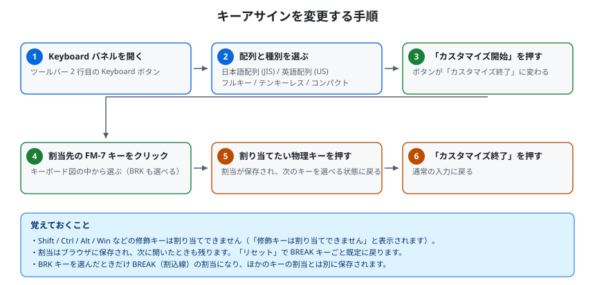
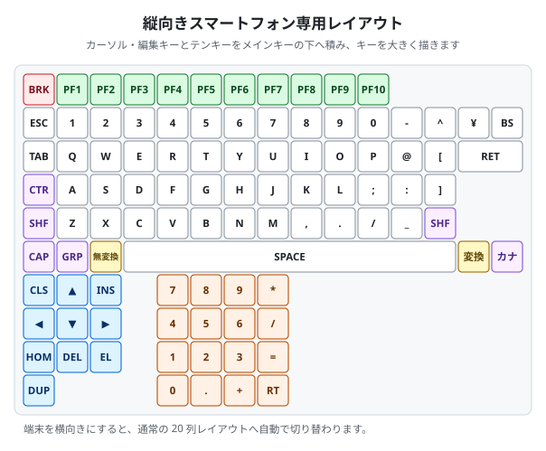

# キーボードマニュアル

FM-7 / FM77AV のキーが、お手元のキーボードのどのキーに当たるかを、図でご案内します。

はじめて WebM7 をお使いの方は、先に[チュートリアル](Tutorial.md)をご覧ください。

キーの入力方法は 2 つあります。どちらも、シミュレータの中では同じ「FM-7 のキー入力」になります。

| 方法 | 使う場所 | 向いている場面 |
|---|---|---|
| **物理キーボード** | 画面（Screen）をクリックしてから、PC のキーボードを打つ | ふだんの入力 |
| **ソフトウェアキーボード** | Keyboard パネルのキーボード図（PC）、または画面の下に出るキーボード（タッチ端末）をクリック / タップ | 物理キーに無いキー（PF・GRPH・カナ など）を押したいとき、スマートフォン / タブレット |

> 物理キーボードから入力するには、**まず画面（Screen）をクリック**してください。クリックするまでキー入力はシミュレータへ渡りません。

---

## 1. FM-7 / FM77AV のキーボードを知る

### 1-1. キーボード図を開く

ツールバー 2 行目の **Keyboard** ボタンで **Keyboard パネル**が開きます。パネルには次のものがあります。

- 押したキーの位置情報（`event.code`）を表示する欄
- FM-7 のキーボード図（クリックするとそのキーを入力できます）
- 現在のキー入力方式の表示（**ASCII** または **SCAN**）
- キーカスタマイズの操作部（第 5 章）

キー入力方式は機種によって変わります。**FM-7 / FM-77 は ASCII**（キーコードを直接受け取る方式）、**FM77AV 系はスキャンコード**（キーの位置番号とキーを離したことを表すコードも送る方式）です。FM77AV 系ではソフトウェア側の指定で切り替わることがあり、現在どちらで動いているかは Keyboard パネル右上と画面下のステータス表示で確認できます。

### 1-2. FM-7 / FM-77 のキーボード

図1: FM-7 / FM-77 のキー配置です。左上に **BRK**、その右に **PF1〜PF10**、右側に編集・カーソルキーとテンキーが並びます。

### 1-3. FM77AV 系のキーボード

図2: FM77AV 系では最下段のスペースバーが 3 つに分かれ、**無変換 / SPACE / 変換** になります。そのぶん SPACE キーは図1 より狭くなり、**カナ** キーの位置は機種によらず同じ場所に揃います。

機種によるキーボードの違いは次のとおりです。

| 項目 | FM-7 / FM-77 | FM77AV | FM77AV20 以降 |
|---|---|---|---|
| 無変換 / 変換 キー | 無し（SPACE が広い） | 有り | 有り |
| BRK キーの表示色 | 他のキーと同じ | 他のキーと同じ | 朱色 |
| キー入力方式 | ASCII | スキャンコード（ブレイクコード対応） | スキャンコード（ブレイクコード対応） |

※「FM77AV20 以降」は FM77AV20 / FM77AV20EX / FM77AV40 / FM77AV40EX/SX です。この違いは Keyboard パネルのキーボード図と、タッチ端末のソフトウェアキーボードの両方に反映されます。

3 つに分かれたスペースキーは、ASCII 方式ではどれを押しても空白が入力され、スキャンコード方式ではそれぞれ別のコードを返します。

### 1-4. キートップの十字の表示

文字キー（英数・記号・カナ）のキートップには、そのキーで入力できる文字が**十字に 4 つ**表示されます。

| 位置 | 入力される文字 |
|---|---|
| 左 | そのまま押したとき |
| 上 | Shift を押しながら |
| 右 | GRPH を押しながら（グラフィック文字） |
| 下 | カナ が ON のとき（半角カタカナ） |

いま入力される文字が白く、ほかは淡い色で描かれ、**SHF / CAP / GRP / カナ** の状態に合わせて切り替わります。この表示は CG ROM の字形をそのまま使っているため、ROM が読み込まれていないときは文字の代わりに英字のラベルが出ます。

---

## 2. FM-7 固有のキーの意味

| キー | 読み | 意味 |
|---|---|---|
| **BRK** | BREAK | 割込を発生させます。BASIC で実行中のプログラムを止めるときなどに使います |
| **PF1〜PF10** | ファンクション | FM-7 のファンクションキーです |
| **ESC** | エスケープ | ESC コードを入力します |
| **CTR** | CTRL | コントロールキーです |
| **CAP** | CAPS | 押すたびに ON / OFF。ON の間は英字が大文字になります（LED が点灯します） |
| **GRP** | GRPH | 押している間だけ有効。キーがグラフィック文字を入力します |
| **カナ** | カナ | 押すたびに ON / OFF。ON の間は半角カタカナを入力します（LED が点灯します） |
| **SHF** | SHIFT | シフトキーです。左右どちらも同じ働きをします |
| **HOM** | HOME | HOME キーです |
| **INS** | INSERT | 押すたびに挿入モードの ON / OFF が切り替わります（LED が点灯します） |
| **DEL** | DELETE | DEL キーです |
| **BS** | バックスペース | BS キーです |
| **↑ ↓ ← →** | カーソル | カーソルキーです |
| **RET** | RETURN | 改行（RETURN）です |
| **RT** | テンキーの RETURN | テンキー側の RETURN です |
| **無変換 / 変換** | — | FM77AV 以降の 3 分割スペースの左右のキーです |
| **EL / CLS / DUP** | — | 実機のキー配置に合わせて図に置いていますが、現在これらのキーには入力コードを割り当てていないため、押しても何も入力されません |

> **CAP / カナ / INS** の点灯状態は、キーボード図のキーの下線と、画面下のステータス表示の LED で確認できます。

---

## 3. 物理キーボードとの対応

### 3-1. 対応の決まり方

WebM7 は、押されたキーを**キーボード上の位置**（ブラウザが返す `event.code`）で判定します。文字そのものではなく位置で見ているため、**日本語配列（JIS 106/109）でも英語配列（ASCII / US 101/104）でも、同じ場所のキーが同じ FM-7 キーになります**。OS のキーボード設定や日本語入力の状態に左右されにくい方式です。

以下の図では、**上段が物理キーの刻印、下段がそのキーに割り当たる FM-7 のキー**です。「—」はそのキーに FM-7 のキーが割り当たっていないことを表します。

### 3-2. 日本語配列（JIS 106/109）

図3: 日本語配列での対応です。**Esc** キーが BREAK、**半角/全角**キーが FM-7 の ESC、**左 Alt** が GRPH、**右 Alt** と **かな** キーが カナ になります。実機の配置と同じく、PC の Esc の位置が BREAK なので、左上のキーと覚えると見つけやすくなります。

FM-7 の ESC を入力するときは、半角/全角キーで日本語入力（IME）が切り替わることがあります。入力が届かないときは、キーカスタマイズ（第 5 章）で **ESC** を別のキーに割り当ててください。**Pause** は常に BREAK として使えますが、ESC の代わりにはなりません。

### 3-3. 英語配列（ASCII / US 101/104）

図4: 英語配列での対応です。**Esc** キーが BREAK、**バッククォート**（`` ` ``）キーが FM-7 の ESC、**左 Alt** が GRPH、**右 Alt** が カナ になります。日本語配列にしか無いキー（`]` `_` 無変換 変換）は、この配列では直接は押せません（第 3-5 節）。

### 3-4. 編集キー・カーソルキー・テンキー（配列共通）

図5: 編集キー・カーソルキー・テンキーの対応は、日本語配列でも英語配列でも同じです。**Pause** キーはどの配列でも常に BREAK として使えます。

### 3-5. FM-7 固有キーの対応表

| FM-7 のキー | 位置情報（`event.code`） | 日本語配列の物理キー | 英語配列の物理キー |
|---|---|---|---|
| BRK（BREAK） | `Escape`（既定）／ `Pause`（常時） | Esc、Pause | Esc、Pause |
| PF1〜PF10 | `F1`〜`F10` | F1〜F10 | F1〜F10 |
| ESC | `Backquote` | 半角/全角 | バッククォート（`` ` ``） |
| CTR | `ControlLeft` | 左 Ctrl | 左 Ctrl |
| CAP | `CapsLock` | CapsLock | CapsLock |
| GRP（GRPH） | `AltLeft` | 左 Alt | 左 Alt |
| カナ | `AltRight` ／ `KanaMode` | 右 Alt、かな | 右 Alt |
| SHF | `ShiftLeft` ／ `ShiftRight` | 左右の Shift | 左右の Shift |
| RET | `Enter` | Enter | Enter |
| BS | `Backspace` | BS | Backspace |
| TAB | `Tab` | Tab | Tab |
| HOM（HOME） | `Home` | Home | Home |
| INS | `Insert` | Insert | Insert |
| DEL | `Delete` | Delete | Delete |
| ↑ ↓ ← → | `ArrowUp` `ArrowDown` `ArrowLeft` `ArrowRight` | ↑↓←→ | ↑↓←→ |
| EL / CLS / DUP | `End` ／ `PageUp` ／ `PageDown` | End / PageUp / PageDown | End / PageUp / PageDown |
| 無変換 | `NonConvert` | 無変換 | **無し** |
| 変換 | `Convert` | 変換 | **無し** |
| @ | `BracketLeft` | P の右の @ | `[` |
| [ | `BracketRight` | @ の右の [ | `]` |
| ] | `IntlBackslash` | ホーム段の ] | **無し** |
| ¥ | `Backslash` | ^ の右の ¥ | `\` |
| ^ | `Equal` | 0 - の右の ^ | `=` |
| : | `Quote` | ; の右の : | `'` |
| _ | `IntlRo` | 右 Shift の左の「ろ」のキー | **無し**（Ctrl + / で代替） |
| テンキー 0〜9 . + * / | `Numpad0`〜`Numpad9` `NumpadDecimal` `NumpadAdd` `NumpadMultiply` `NumpadDivide` | テンキー | テンキー |
| RT（テンキーの RETURN） | `NumpadEnter` | テンキーの Enter | テンキーの Enter |
| テンキーの = | `NumpadEqual` | **無し** | **無し** |

このほか、テンキーの **-**（`NumpadSubtract`）を押すと `-` が入力されます（FM-7 のキーボード図には無いキーですが入力できます）。

### 3-6. 英語配列で足りないキーと代替手段

英語配列のキーボードには、日本語配列にしか無いキーがありません。次の方法で入力します。

| 入力したいキー | 方法 |
|---|---|
| `_` | **Ctrl + /** を押します |
| `]` | キーカスタマイズ（第 5 章）で好きな物理キーに割り当てます |
| 無変換 / 変換 | キーカスタマイズで好きな物理キーに割り当てます |
| テンキーの `=` | キーカスタマイズで好きな物理キーに割り当てます |

- `@` は、英語配列では **P の右の `[` キー**にそのまま割り当たっているため、修飾キーとの組み合わせは要りません。
- Keyboard パネルのキーボード図は、これらのキーもクリックで入力できます。**一度きりの入力ならキーボード図をクリックするのが手軽です。**
- キーカスタマイズで「英語配列 (US)」と「テンキーレス」「コンパクト」を選ぶと、その配列に無い物理キーへ割り当たっている FM-7 キーが、キーボード図の上で破線の枠で示されます。割り当て直す目印にしてください。

### 3-7. Cursor → Ten Key（カーソルキーをテンキーとして使う）

テンキーの無いキーボードでも、テンキーを使うソフトを操作できるようにする設定です。サイドパネルの **Options** で **Cursor → Ten Key** にチェックを入れると、カーソルキーがテンキーとして働きます。

| カーソルキー | テンキー |
|---|---|
| ↑ | 8 |
| ↓ | 2 |
| ← | 4 |
| → | 6 |

チェックを入れている間はカーソルキー本来の働きが置き換わります。設定はブラウザに保存されます。

---

## 4. ソフトウェアキーボードの操作

Keyboard パネルのキーボード図は、**クリックするとそのキーがシミュレータへ入力されます**。タッチ端末のソフトウェアキーボードも同じ動きです。物理キーボードに無いキーや、押しにくい組み合わせのときに便利です。

図6: 修飾キーの動きです。**SHF はスティッキー**（押すたびに ON / OFF が切り替わり、次のキーを押して離すと自動で戻ります）、**GRP は押している間だけ**、**CAP / カナ / CTR はトグル**です。

- **BRK** はクリックしている間だけ BREAK の割込が入ります。
- キーボード図のキーは、物理キーボードを押したときにも光ります。どのキーが押されているかの確認に使えます。
- ウィンドウのフォーカスが外れた（Alt+Tab など）ときは、押しっぱなしのキーと GRPH を解除します。CAP / カナ / INS の ON / OFF はそのまま保たれます。

---

## 5. キーの割り当てを変える（キーカスタマイズ）

「この FM-7 キーを、自分のキーボードのこのキーで押したい」というときに使います。**FM-7 / FM77AV に共通の設定**で、ブラウザに保存されます。

### 5-1. Keyboard パネルの見取り図

図7: Keyboard パネルの各部です。

| 番号 | 内容 |
|---|---|
| 1 | 押したキーの位置情報（`event.code`）の表示 |
| 2 | FM-7 のキーボード図。ふだんはクリックで入力、カスタマイズ中は割当先の選択に使います |
| 3 | **配列**の選択 — 日本語配列 (JIS) / 英語配列 (US) |
| 4 | **種別**の選択 — フルキー / テンキーレス / コンパクト |
| 5 | **カスタマイズ開始** — 押すと **カスタマイズ終了** に変わります |
| 6 | **リセット** — 割当と BREAK キーを既定に戻します |
| 7 | 操作の案内（カスタマイズ中だけ表示されます） |
| 8 | 現在の割当の一覧。**✕** でその割当だけを削除できます |

配列と種別の選択は、**その配列・種別に無い物理キーへ割り当たっている FM-7 キーを目立たせる**ためのものです。選んだだけでは割当は変わりません。

### 5-2. 変更の手順

図8: 手順の流れです。

1. ツールバー 2 行目の **Keyboard** ボタンで Keyboard パネルを開きます。
2. **配列**（日本語配列 / 英語配列）と**種別**（フルキー / テンキーレス / コンパクト）を選びます。
3. **カスタマイズ開始** を押します。ボタンが **カスタマイズ終了** に変わり、案内が表示されます。
4. キーボード図の中から、**割り当て先の FM-7 キーをクリック**します。「「◯◯」に割り当てる物理キーを押してください」と表示されます。
5. **割り当てたい物理キーを押します。** 割当が保存され、「次の FM-7 キーをクリック」の表示に戻ります。続けて別のキーも設定できます。
6. 終わったら **カスタマイズ終了** を押します。通常の入力に戻ります。

割り当てた内容は 8 の一覧に「**物理キー → FM-7 キー**」の形で並びます。ひとつだけ取り消したいときは、その行の **✕** を押します。

### 5-3. BREAK キーを変える

BREAK は文字キーとは別の割込のため、割当も別に保存されます。手順は同じで、**キーボード図の BRK キーをクリック**してから割り当てたい物理キーを押します。

- 既定は **Esc** キーです。
- **Pause** キーは、どこに割り当てても常に BREAK として使えます。
- BREAK を別のキーへ移す場合も、この手順で割り当てます。半角/全角キーで日本語入力（IME）が反応する場合は、**ESC** 側の割当を変えてください（第 3-2 節）。

### 5-4. 保存と初期化

設定はお使いのブラウザに保存され（localStorage）、次に開いたときもそのまま使えます。サーバーへ送られることはありません。配列・種別・キーの割当・BREAK キーの割当を保存します。

**リセット** を押すと、キーの割当と BREAK キーの割当がまとめて既定に戻ります（**Cursor → Ten Key** の設定は Options 側なので、この操作では変わりません）。

### 5-5. 気をつけること

- **修飾キー（Shift / Ctrl / Alt / Win など）は割り当てできません。** 押すと「修飾キーは割り当てできません」と表示されます。
- **OS やブラウザが先に受け取ってしまうキーがあります。** 日本語配列の 半角/全角、Windows キー、ブラウザのショートカット（F5 など）は、WebM7 まで届かないことがあります。届かないキーには別のキーを割り当ててください。
- **日本語入力（IME）が ON のときは、入力がうまく渡らないことがあります。** IME を OFF（直接入力）にしてお使いください。
- 割当は「物理キー 1 つ → FM-7 キー 1 つ」です。同じ物理キーに 2 つの FM-7 キーを割り当てることはできません。
- 割当は **Cursor → Ten Key** と同じ仕組みで合成されます。両方を使うと、カーソルキーの割当は Cursor → Ten Key が優先します。

---

## 6. スマートフォン / タブレットのソフトウェアキーボード

タッチ端末では、画面のすぐ下にソフトウェアキーボードが表示されます。キーをタップするとシミュレータへ入力されます。

- 右上の **×** で閉じ、モバイルアクションバーのキーボードボタンで再表示できます（表示 / 非表示はブラウザに保存されます）。
- 修飾キーの動きは Keyboard パネルのキーボード図と同じです（第 4 章）。
- **横向き**では図1・図2 と同じ 20 列のレイアウトになります。

**縦向きのスマートフォン**では、キーを大きくするために専用のレイアウトへ自動で切り替わります。

図9: 縦向き専用のレイアウトです。カーソル・編集キーとテンキーをメインキーの下へ積むことで横幅を抑え、キーを大きく描いています。端末を回すと自動で横向きのレイアウトへ戻ります。

---

## 7. 困ったときは

| 症状 | 確認・対処 |
|---|---|
| キーを打っても何も起きない | **画面（Screen）をクリック**してから入力してください。スマートフォンではソフトウェアキーボードをタップします |
| 文字が全部おかしな記号になる | **GRPH（左 Alt）が押しっぱなし**か、**カナ が ON** になっていないか、画面下のステータス表示で確認してください |
| 英字が大文字だけ / 小文字だけになる | **CAP** の点灯状態を確認してください。CapsLock キーで切り替わります |
| `@` `[` `]` `¥` `_` が思ったとおりに入らない | 第 3 章の対応表で位置を確認してください。お使いのキーボードやブラウザによって送られるキーの位置情報が違うことがあります。合わないときはキーカスタマイズで割り当ててください |
| BREAK が効かない | 既定は **Esc** キーです。**Pause** キーも常に使えます。保存済みの割当がある場合は Keyboard パネルで確認し、**リセット** で既定へ戻すか、キーカスタマイズで別のキーへ移してください |
| ESC を入力すると IME が切り替わる / ESC が効かない | 既定は **半角/全角**（英語配列では **バッククォート**）の位置です。キーカスタマイズで **ESC** を別のキーへ割り当ててください。**Pause** は BREAK 用で、ESC の代わりにはなりません |
| PF キー（PF1〜PF10）が効かない | ブラウザや OS がファンクションキーを先に取っていることがあります。Keyboard パネルのキーボード図の **PF1〜PF10** をクリックしても入力できます |
| テンキーを使うプログラムが操作できない | テンキーの無いキーボードでは Options の **Cursor → Ten Key** をチェックしてください |
| Alt+Tab のあとキーがおかしい | フォーカスが戻った時点で押しっぱなしのキーは解除されます。直らないときは一度画面をクリックし直してください |
| EL / CLS / DUP を押しても何も起きない | これらのキーには現在入力コードを割り当てていません（第 2 章） |
| 割当を元に戻したい | Keyboard パネルの **リセット** で、キーの割当と BREAK キーが既定に戻ります |

---

## 関連マニュアル

- [チュートリアル（はじめてガイド）](Tutorial.md) — ROM の読み込みから起動・基本操作まで
- [テープ操作マニュアル](Tape_Manual.md) — テープの LOAD / SAVE
- [機種比較](MachineComparison.md) — 機種ごとの機能一覧
