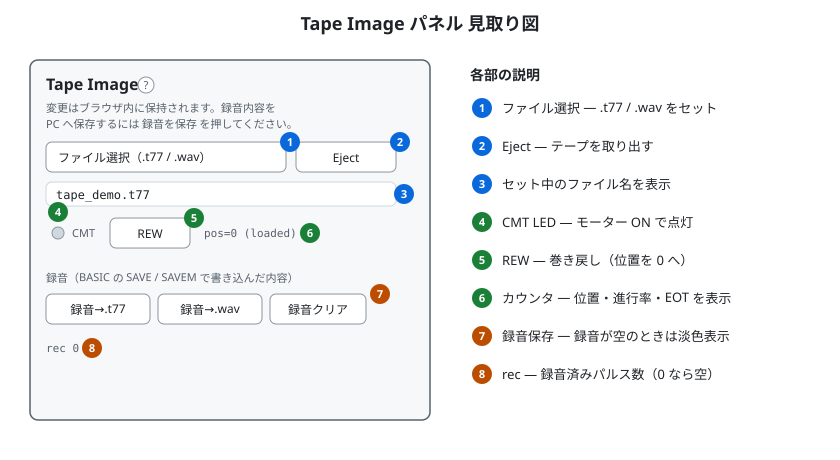
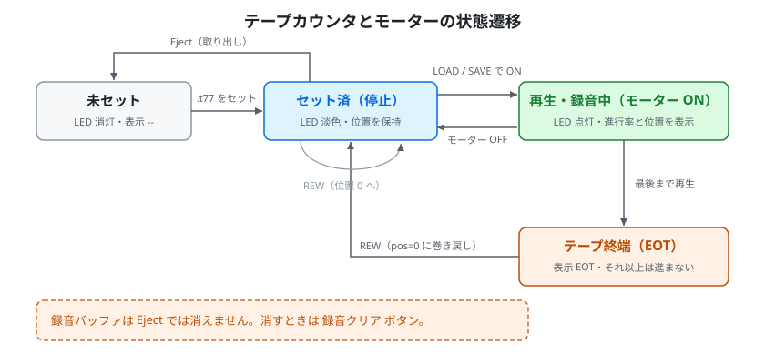
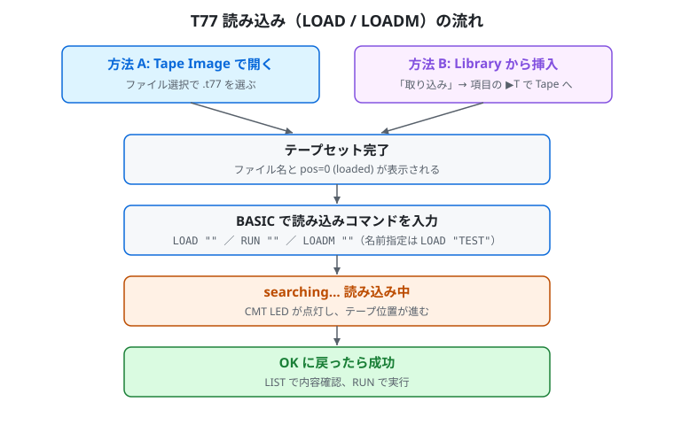
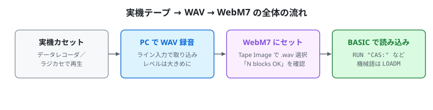
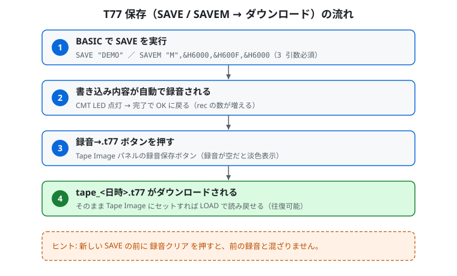
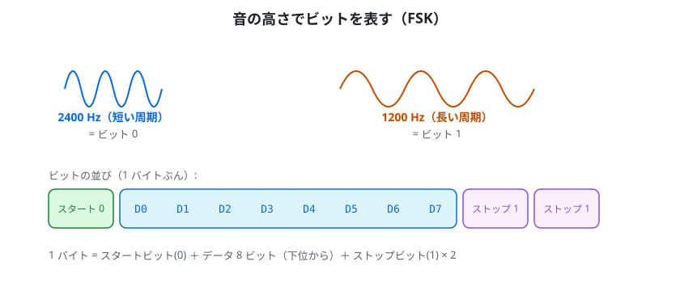
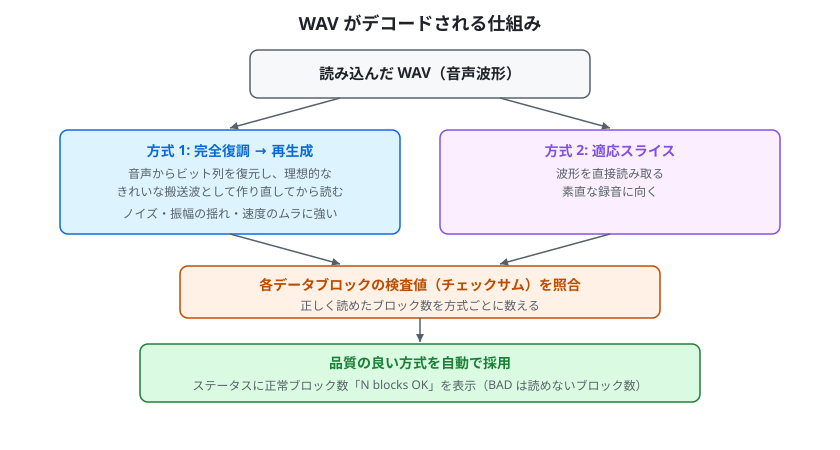
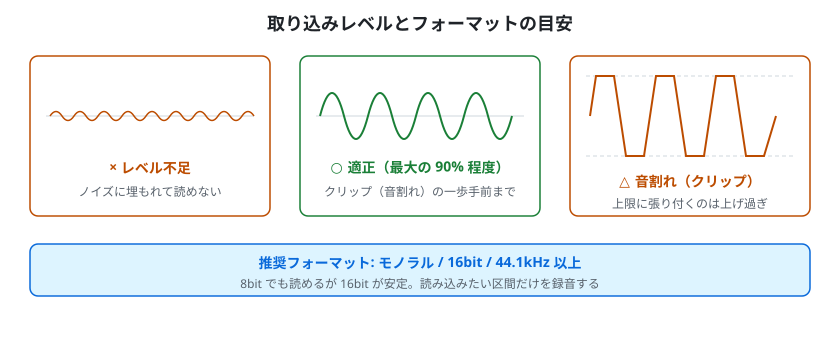
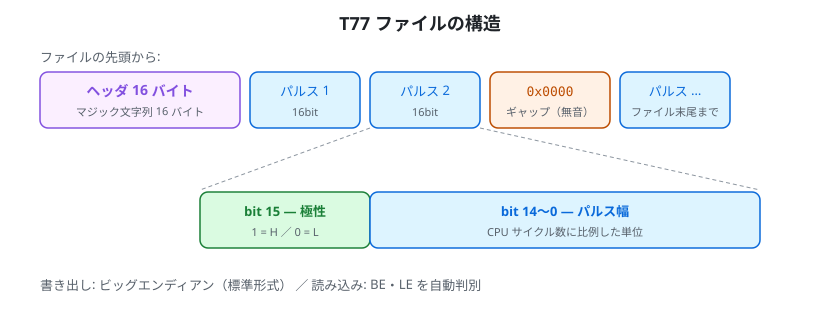
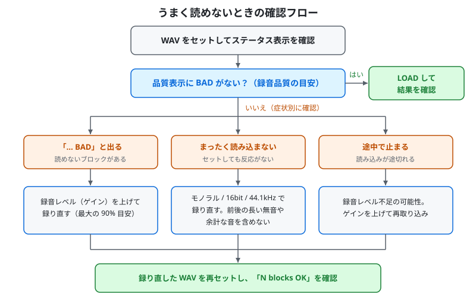

# テープ操作マニュアル

WebM7 でカセットテープを読み書きする手順を解説します。対応形式は次の 2 つです。

- **T77 形式** — テープのパルス列を符号化したテープイメージファイル
- **WAV 形式** — 実機のテープをそのまま録音した音声ファイル（PCM）

どちらも操作の入口は同じ **Tape Image** パネルです。

- **読み込み (LOAD/LOADM)** — T77 / WAV を再生して BASIC プログラム / 機械語を取り込む
- **書き込み (SAVE/SAVEM)** — BASIC プログラム / 機械語を録音し、T77 または WAV ファイルとして保存する

書き込んだ T77 / WAV は **Tape Image** にセットして LOAD で読み込み、結果を確認できます。

---

## 1. テープの基礎と Tape Image パネル

### 1-1. 前提条件

テープを扱う前に以下を準備します:

1. ROM は既定の同梱互換 ROM のままで構いません（操作不要）。お手持ちの ROM を使う場合のみ、**ROM Files** で読み込みます。
2. ヘッダーの**機種タブ**で機種を選択（FM-7 / FM-77 / FM77AV / FM77AV20 / FM77AV40 / FM77AV20EX / FM77AV40EX）。
3. 機種別ハードウェアパネルで**起動モード**を **BASIC** に設定。
4. ハードウェアパネルの**電源スイッチ**を押す。BASIC が起動して `OK` プロンプトが表示されるまで待つ（同梱互換 ROM では 7T-BASIC が起動します）。

> 電源・リセット・起動モードは、機種ごとの配色の**ハードウェアパネル**にあります。操作部の位置はスキン（見た目）によって変わります。詳しくは[チュートリアル](Tutorial.md)の「4. 起動する」を参照してください。

> BASIC キーワードは**大文字**で入力してください。BASIC Paste で `.txt` を流し込む場合も
> 中身は大文字推奨です（小文字のキーワードはエラーになります）。

### 1-2. Tape Image パネルの見取り図

Tape Image パネルの各部は次のとおりです。



左がパネルの配置、右が各部の説明です。

- **ファイル選択** — `.t77` / `.wav` をセットします。
- **Eject** — テープを抜きます。
- **CMT LED とカウンタ** — テープの動作状態と位置を表示します。
- **REW** — テープを先頭に巻き戻します。
- **録音→.t77 / 録音→.wav / 録音クリア** — `SAVE` / `SAVEM` の録音内容を保存・消去します。録音が空のときは保存ボタンは淡色表示になり押せません。

> Tape Image パネルには「変更はブラウザ内に保持されます。録音内容を PC へ保存するには録音を保存を押してください」という案内が常時表示されます。

### 1-3. テープの状態表示

テープの状態とカウンタ表示・CMT LED の関係は次のとおりです。



セット直後は `pos=0 (loaded)` 状態です。LOAD / SAVE 中はモーター ON（LED 点灯）になり、終端まで進むと EOT 表示になります。REW でいつでも先頭（pos=0）に戻せます。

---

## 2. テープを読み込む（LOAD / LOADM）

読み込みの全体像は次のとおりです。



入口は Tape Image / Library の 2 通りですが、セット後の手順はどちらも同じです。

### 2-1. Tape Image セクションから直接読み込む（一番手軽）

1. サイドパネルの **Tape Image** → ファイル選択で `.t77` または `.wav` を開く。
2. ファイル名が表示され、`pos=0 (loaded)` 状態になる（WAV の場合は品質表示も出ます。後述）。
3. BASIC の `OK` プロンプトで:
   - BASIC プログラム: `LOAD ""` ＋ RETURN（または `RUN ""` で読込＋実行）
   - 機械語: `LOADM ""` ＋ RETURN（読込後すぐ実行するなら `LOADM "",,R`）
   - ファイル名指定: `LOAD "TEST"`（テープ上のファイル名と一致するもののみ読込）
   - デバイス名を明示した `LOAD "CAS:"` / `RUN "CAS:"` / `LOADM "CAS:",,R` も同じ意味です。
4. `searching…` 表示中、CMT LED が点灯して読み込みが進む。
5. `OK` に戻ったら成功。`LIST` でプログラムを確認、`RUN` で実行。

### 2-2. Library から挿入する（T77 のみ・複数テープを使い分けたい時に推奨）

1. **Library** セクションの「**取り込み**」（ファイル選択）から `.t77` を選ぶ。
   - Library 一覧に新規項目として登録される（複数の T77 を保有可能）。
   - Library の取り込みは `.d77` / `.t77` のみ対応です。**WAV は Tape Image パネルから直接セット**してください。
2. 該当項目の **▶T** ボタンで **Tape** に挿入。
   - 項目に `[Tape]` タグが付き、Tape Image にも反映される。
3. あとは 2-1 と同じ手順で `LOAD` / `RUN ""`。

### 2-3. 巻き戻し・取り出し

- **REW** ボタン: 同じテープをもう一度読み直したい時に巻き戻す。
- **Eject** ボタン: テープを抜く。

### 2-4. WAV 読み込みの固有手順と注意

実機のテープを PC で WAV に録音し、Tape Image パネルにセットして BASIC から読み込む、という流れです。



1. **Tape Image** パネルのファイル選択で **`.wav`** を選ぶ。セットするとファイル名と品質（`N blocks OK`）が表示される。
2. 正常ブロック数は録音品質の目安です。対応する形式のプログラムを LOAD し、読み込み結果を確認してください。**`BAD` が残る**場合は読み込みに失敗する可能性があります（対処は第 4 章・第 6 章参照）。
3. 読み込みコマンドは 2-1 と共通です（`RUN "CAS:"` / `LOAD "CAS:"` / `LOADM "CAS:",,R` など）。
4. テープの入れ替えを求められたら、次のテープを選択して読み込み操作を行います。


WAV は PCM 8bit / 16bit、モノラル・多チャンネル（多チャンネルは先頭チャンネルを使用）に対応しています。

---

## 3. テープに保存する（SAVE / SAVEM）と録音

保存の全体像は次のとおりです。



BASIC の `SAVE` / `SAVEM` を実行するだけで自動的に録音され、あとは **録音→.t77** / **録音→.wav** ボタンでダウンロードできます。

### 3-1. BASIC プログラムを保存する（`SAVE`）

```
SAVE "ファイル名"
```

- ファイル名は最大 8 文字程度（FM-7 BASIC の慣習）。
- 例: `SAVE "TEST"` ＋ RETURN。デバイス名を明示した `SAVE "CAS:TEST"` も同じ意味です。
- 実行すると CMT LED が点灯、リーダー音 → データ書き込み → `OK` に戻る。
- BASIC のプログラム本体（`LIST` で見えるもの）がテープ上に書かれます。

### 3-2. 機械語を保存する（`SAVEM`、**3 引数必須**）

```
SAVEM "ファイル名", 開始アドレス, 終了アドレス, 実行アドレス
```

- **3 つの引数すべて必須**です。引数が足りないときは `Syntax error` になり、保存されません。
- 例: `&H6000` から `&H600F` までの 16 バイトを保存、実行開始も `&H6000`:
  ```
  SAVEM "M",&H6000,&H600F,&H6000
  ```
- 10 進・16 進どちらでも可（`SAVEM "M",24576,24591,24576` も同じ意味）。
- 読込は `LOADM "M"`（実行アドレスは保存時のものが復元されます）。

### 3-3. 録音内容をファイルとしてダウンロード

`SAVE` / `SAVEM` 実行後、シミュレータは書き込み内容を**録音**しています。`SAVE` の書き込み信号をそのまま記録しているため保存できます。
これをファイルにする方法は次のとおりです。

**A. Tape Image セクションの保存ボタン（シンプル）**

1. `SAVE` 完了（`OK` 表示）を確認。
2. Tape Image の **録音→.t77** ボタンを押すと `tape_<日時>.t77` が、**録音→.wav** ボタンを押すと `tape_<日時>.wav`（PCM WAV 形式）がブラウザでダウンロードされる。
3. 保存したファイルは **Tape Image** にセットして LOAD で読み込み、結果を確認してください。

> 録音内容が無いときは **録音→.t77** ／ **録音→.wav** ボタンは淡色表示になり押せません。`SAVE` を先に実行して録音を作ってください。

> 保存される WAV は、ビットを理想的な矩形波として記録した信号（モノラル 8bit PCM）です。

**B. Library 経由（複数項目として管理したい時）**

1. **Library** の「取り込み」… ではなく、**録音→.t77** で一旦ダウンロード → そのファイルを
   Library に取り込む、という二段階で項目化できます。

### 3-4. 録音バッファのクリア

- **録音クリア** ボタンで現在の録音内容を消去。
- 新規 `SAVE` を始める前に押すと、前の SAVE 内容と混ざらず単独のファイルになります。

### 3-5. 実例 1: 小さな BASIC プログラムを保存して読み戻す

1. `OK` プロンプトで次を入力（BASIC Paste でも手入力でも可）:
   ```
   10 PRINT "HELLO"
   20 FOR I=1 TO 5
   30 PRINT I*I
   40 NEXT I
   50 END
   ```
2. `RUN` で動作確認（`HELLO` と `1 4 9 16 25` が表示される）。
3. `SAVE "DEMO"` ＋ RETURN（CMT LED 点灯 → 完了 → `OK`）。
4. **録音→.t77** ボタンで `tape_*.t77` をダウンロード。
5. `NEW` ＋ RETURN（またはハードウェアパネルの**リセット**）でメモリを消去。
6. Tape Image **Eject** → **録音クリア** で状態をきれいに。
7. ダウンロードした `tape_*.t77` を Tape Image にロード。
8. `LOAD "DEMO"` ＋ RETURN（または `RUN "DEMO"` で読込＋実行）。
9. `LIST` で元のプログラムが復元されていることを確認。

### 3-6. 実例 2: 機械語領域を SAVEM/LOADM で往復

1. `POKE` で `&H6000` から数バイト書き込み:
   ```
   POKE &H6000,&HDE
   POKE &H6001,&HAD
   POKE &H6002,&HBE
   POKE &H6003,&HEF
   ```
2. `PRINT HEX$(PEEK(&H6000));HEX$(PEEK(&H6001));HEX$(PEEK(&H6002));HEX$(PEEK(&H6003))`
   で `DEADBEEF` 確認。
3. `SAVEM "M",&H6000,&H6003,&H6000` ＋ RETURN。
4. **録音→.t77** でダウンロード。
5. `NEW` またはハードウェアパネルの**リセット**。
6. Tape ロード後、`LOADM "M"` ＋ RETURN。
7. 再度 `PRINT HEX$(PEEK(&H6000))…` で `DEADBEEF` が戻っていることを確認。

---

## 4. WAV のデコードの仕組みと録音のコツ

### 4-1. FSK — 音の高さでビットを表す

カセットテープのデータは、音の高さ（周波数）でビットを表す **FSK** という方式の音声信号です。



高い音（2400Hz）がビット 0、低い音（1200Hz）がビット 1 を表し、スタートビットとストップビットで 1 バイトずつ区切られています。

### 4-2. 2 つのデコード方式の自動選択

WebM7 は読み込んだ WAV を解析し、録音状態に応じて 2 つの方式を**自動で切り替え**ます。

1. **完全復調 → 再生成** — 音声からビット列を復元し、**理想的なきれいな搬送波**として作り直してから読みます。録音のノイズ・振幅の揺れ・テープ速度のムラ（ワウフラッター）に強い方式です。
2. **適応スライス** — 波形を直接読み取ります。素直な録音に向きます。

さらに、テープ内の各データブロックには**検査値（チェックサム）**が付いています。WebM7 はこれを内部で照合して「正しく読めているか」を判定し、品質の良い方式を選びます。読み込み時にステータスへ **正常ブロック数**が表示されます。



2 つの方式で読み取った結果をチェックサムで採点し、良い方を自動採用します。結果はステータスの `N blocks OK` 表示で確認できます。

### 4-3. テープから WAV を作るときのコツ（重要）

実機のテープやラジカセから WAV に取り込む際は、次の点に気をつけると読み込み成功率が大きく上がります。

- **録音レベル（ゲイン）を大きめに** — 取り込みレベルを最大の **90% 程度**まで上げてください（クリップ＝音割れの一歩手前）。レベルが小さいと信号がノイズに埋もれ、読み込めません。
- **形式は モノラル / 16bit / 44.1kHz 以上**を推奨。8bit でも読めますが 16bit が安定します。
- **テープ速度が安定したデッキ**を使い、**ヘッドを清掃**しておく。速度の揺らぎ（ワウフラッター）は読み込みを難しくします。
- **無音・別プログラムの音を含めない** — 可能なら読み込みたいプログラムの区間だけを録音する。
- 取り込んだ WAV をセットすると、品質表示に正常ブロック数（`N blocks OK`）が出ます。正常ブロック数は録音品質の目安です。対応する形式のプログラムを LOAD し、読み込み結果を確認してください。**`BAD` が残る**場合は、ゲインを上げて録り直すと解消することが多いです。



レベル不足はノイズに埋もれて読めず、上限に張り付くのは上げ過ぎです。クリップ一歩手前（最大の 90% 程度）を目安にしてください。

---

## 5. T77 形式の構造（参考）

- T77 はカセットテープの**パルス列**を符号化したファイル形式です。各 16bit エントリが
  「polarity (1bit) + width (15bit)」を表し、width は CPU サイクル数に比例した単位です。
- WebM7 の 録音→.t77 は標準的な T77 形式 (**16 バイトヘッダ + ビッグエンディアン**) で
  書き出します。LOAD 側は BE/LE を自動検出します。
- ファイル先頭に 16 バイトのマジックヘッダ、続けて慣例どおり無音を表す `0x0000`
  レコードを 1 つ置き、その後にパルス列が続きます。



16 バイトのヘッダの後に 16bit のパルスエントリが並び、`0x0000` は無音（ギャップ）を表します。

---

## 6. よくある質問 / トラブルシューティング

| 症状 | 確認・対処 |
|---|---|
| `SAVEM` で何も起きない（モーター動かない） | **3 引数すべて指定**しているか確認。`SAVEM "M",a,b,c` の形式。 |
| `SAVE` で `Syntax error` | ファイル名がダブルクォートで囲まれているか。文字数は 8 字以内。 |
| `LOAD` が `searching…` で進まない | テープがセットされているか、`REW` で巻き戻したか、ファイル名が一致しているか。 |
| `LOAD` 時に `?Device I/O error` | テープのデータが壊れている可能性。同じ T77 が別の手段（実機・他環境）で読めるか確認。 |
| 録音→.t77 / 録音→.wav ボタンを押しても何も起きない | `rec` 表示が 0 のままなら録音バッファが空。SAVE を先に実行すること。 |
| 保存した T77 が他環境で開けない | WebM7 は 16 バイトヘッダ + ビッグエンディアンの T77 形式で書き出します。読み込み側がこの形式に対応しているか確認してください。 |
| 同じ SAVE 内容と新しい SAVE が混ざる | SAVE 前に **録音クリア** で録音バッファをクリア。 |
| `LOAD` 中に進捗が止まる | シミュレータがテープ読み込み時に自動高速化するので、通常は数秒で完了。停止する場合はハードウェアパネルの**リセット** → 再ロード。 |

### WAV がうまく読めないとき



まずセット時のステータス表示を確認し、症状別に対処してから再セットして確認します。

- ステータスに **`... BAD`** と出る … その数だけ読めないブロックがあります。**録音レベルを上げて録り直す**（第 4 章のコツ）と解消することが多いです。
- まったく読み込まない … モノラル・16bit・44.1kHz で録り直す。区間の前後に余計な音や長い無音を含めない。
- 途中で止まる … テープの入れ替え待ちか確認し、必要なら次のテープを選択して読み込み操作を行います。

### Tips

- `LOAD ""` / `RUN ""` は「テープ上の次のファイルを読み込む」動作です。ファイル名指定の
  `LOAD "TEST"` は「`TEST` という名前のファイルが見つかるまで読み飛ばす」動作です。
- 複数の SAVE をひとつのテープファイルに詰めることも可能です（**録音クリア** を押さずに連続 SAVE）。
  読み出し側は `REW` で巻き戻してから順に LOAD します。
- 録音バッファは **Eject** では消えません。**録音クリア** で明示的に消去してください。

---

## 7. 対応範囲と取り込み方法

- **マルチファイル T77（複数プログラムを 1 本のテープに）** は LOAD 側で対応しており、
  SAVE 側も連続 `SAVE` で実現可能です。
- **Library の取り込みは `.d77` / `.t77` のみ**です。WAV は Tape Image パネルから直接セットしてください。
