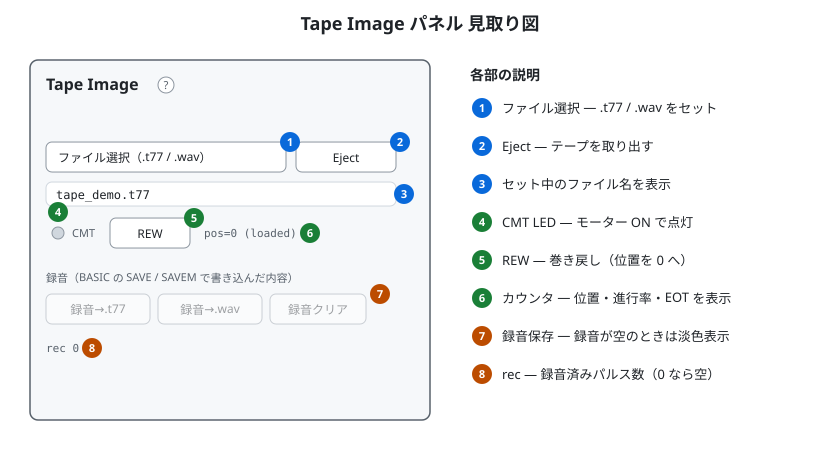
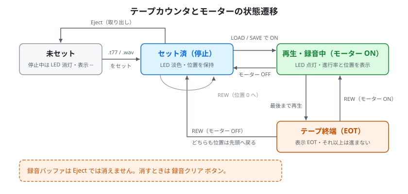
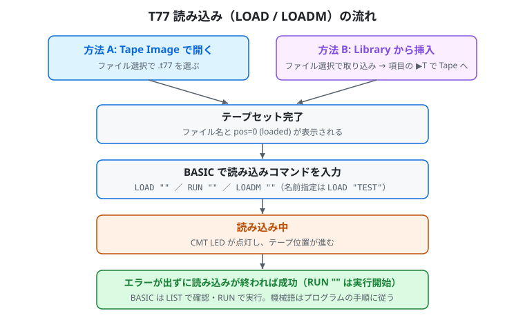
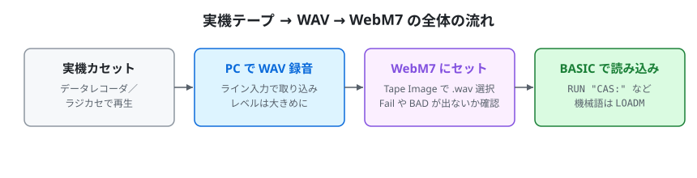
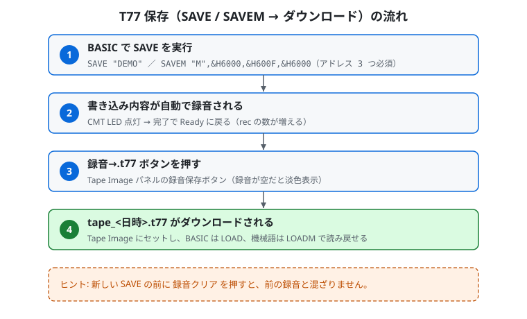
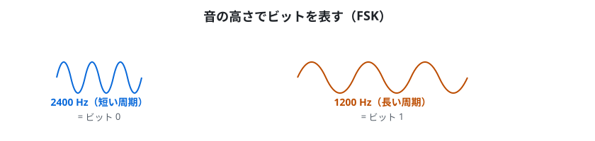
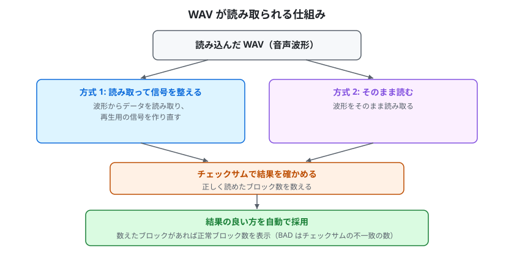
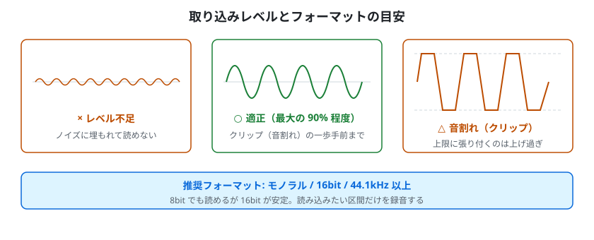
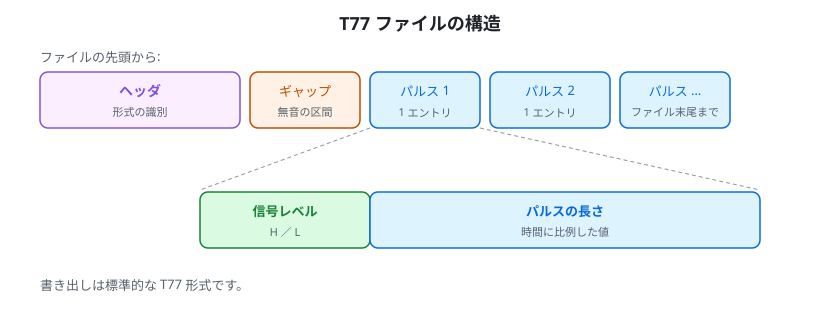
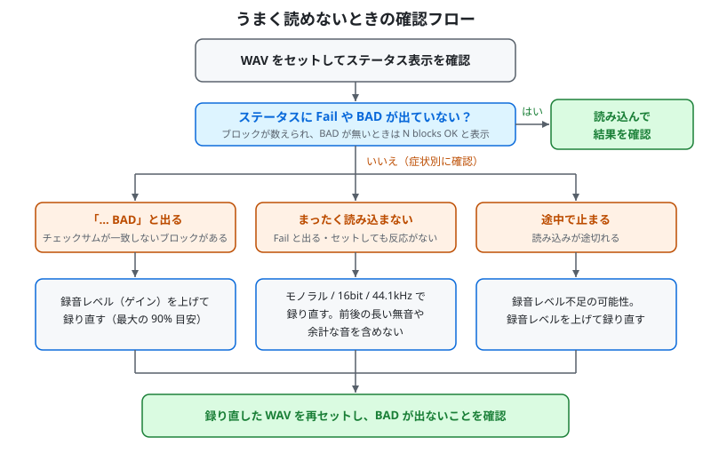

# テープ操作マニュアル

WebM7 でカセットテープを読み書きする手順を解説します。対応形式は次の 2 つです。

- **T77 形式** — テープのパルス列を符号化したテープイメージファイル
- **WAV 形式** — 実機のテープをそのまま録音した音声ファイル（PCM）

どちらも操作の入口は同じ **Tape Image** パネルです。

- **読み込み (LOAD/LOADM)** — T77 / WAV を再生して BASIC プログラム / 機械語を取り込む
- **書き込み (SAVE/SAVEM)** — BASIC プログラム / 機械語を録音し、T77 または WAV ファイルとして保存する

書き込んだ T77 / WAV は **Tape Image** にセットし、BASIC プログラムは LOAD、機械語は LOADM で読み戻して確認できます。

---

## 1. テープの基礎と Tape Image パネル

### 1-1. 前提条件

テープを扱う前に以下を準備します:

1. ROM は既定の同梱互換 ROM のままで構いません（操作不要）。ただし、同梱互換 ROM の BASIC が読み書きするプログラムはアスキー形式だけです。中間コード形式で保存されたテープを読み込むときなど、お手持ちの ROM を使う場合のみ、**ROM Files** で読み込みます。
2. ヘッダーの**機種タブ**で機種を選択。
3. 機種別ハードウェアパネルで**起動モード**を **BASIC** に設定。
4. Drive 0 にディスクが入っていれば取り出してから、ハードウェアパネルの**電源スイッチ**を押す。BASIC が起動して `Ready` プロンプトが表示されるまで待つ（同梱互換 ROM では 7T-BASIC が起動します）。

> 電源・リセット・起動モードは、機種ごとの配色の**ハードウェアパネル**にあります。操作部の位置はスキン（見た目）によって変わります。詳しくは[チュートリアル](Tutorial.md)の「4. 起動する」を参照してください。

> BASIC キーワードは**大文字**で入力してください。BASIC Paste で `.txt` を流し込む場合も
> 中身は大文字を推奨します（小文字だと命令として解釈されない場合があります）。

### 1-2. Tape Image パネルの見取り図

Tape Image パネルの各部は次のとおりです。



左がパネルの配置、右が各部の説明です。

- **ファイル選択** — `.t77` / `.wav` をセットします。一度セットしたファイルがあれば、先に**最近使ったファイル**の一覧が開きます（→ 2-5）。
- **Eject** — テープを抜きます。
- **CMT LED とカウンタ** — テープの動作状態と位置を表示します。
- **REW** — テープを先頭に巻き戻します。
- **録音→.t77 / 録音→.wav / 録音クリア** — `SAVE` / `SAVEM` の録音内容を保存・消去します。録音が空のときは保存ボタンは淡色表示になり、押しても保存されません。

### 1-3. テープの状態表示

テープの状態とカウンタ表示・CMT LED の関係は次のとおりです。



セット直後は `pos=0 (loaded)` 状態です。LOAD / SAVE 中はモーター ON（LED 点灯）になり、終端まで進むと EOT 表示になります。REW でいつでも先頭（pos=0）に戻せます。

---

## 2. テープを読み込む（LOAD / LOADM）

読み込みの全体像は次のとおりです。



入口は Tape Image のファイル選択（最近使ったファイルの一覧を含む）と Library の 2 通りですが、セット後の手順はどちらも同じです。

### 2-1. Tape Image セクションから直接読み込む（一番手軽）

1. サイドパネルの **Tape Image** → ファイル選択で `.t77` または `.wav` を開く。
   - 一度セットしたテープがあれば、ダイアログの前に**最近使ったファイル**の一覧が開きます。行をクリックするとそのテープがセットされ、新しいファイルを選ぶときは「Choose a new file…」を押します（詳しくは 2-5）。
2. ファイル名が表示され、`pos=0 (loaded)` 状態になる（WAV の場合は品質表示も出ます。後述）。
3. BASIC の `Ready` プロンプトで:
   - BASIC プログラム: `LOAD ""` ＋ RETURN（または `RUN ""` で読込＋実行）
   - 機械語: `LOADM ""` ＋ RETURN（読込後すぐ実行するなら `LOADM "",,R`）
   - ファイル名指定: `LOAD "TEST"`（テープ上のファイル名と一致するもののみ読込）
   - デバイス名を明示した `LOAD "CAS:"` / `RUN "CAS:"` / `LOADM "CAS:",,R` も同じ意味です。
4. 読み込み中は CMT LED が点灯し、カウンタの表示が進む。
5. エラーが表示されずに `Ready` に戻れば読み込みは成功です。BASIC プログラムは `LIST` で確認、`RUN` で実行。エラーが表示されたときの対処は第 6 章を参照してください。

### 2-2. Library から挿入する（複数テープを使い分けたい時に推奨）

1. **Library** セクションの「**取り込み**」（ファイル選択）から `.t77` を選ぶ。
   - Library 一覧に新規項目として登録される（複数の T77 を保有可能）。
   - Library は `.d77` / `.2d` / `.t77` を取り込めます。**WAV は Tape Image パネルから直接セット**してください。
2. 該当項目の **▶T** ボタンで **Tape** に挿入。
   - 項目に `[Tape]` タグが付き、Tape Image にも反映される。
3. あとは 2-1 と同じ手順で `LOAD` / `RUN ""`。

### 2-3. 巻き戻し・取り出し

- **REW** ボタン: 同じテープをもう一度読み直したい時に巻き戻す。
- **Eject** ボタン: テープを抜く。

### 2-4. WAV 読み込みの固有手順と注意

実機のテープを PC で WAV に録音し、Tape Image パネルにセットして BASIC から読み込む、という流れです。



1. **Tape Image** パネルのファイル選択で **`.wav`** を選ぶ。セットするとファイル名が表示され、数えられたブロックがある場合は品質（`N blocks OK` など）も表示される。
2. 正常ブロック数は録音品質の目安です。**`BAD` が残る**場合は読み込みに失敗する可能性があります（対処は第 4 章・第 6 章参照）。
3. 読み込みコマンドは 2-1 と共通です（`RUN "CAS:"` / `LOAD "CAS:"` / `LOADM "CAS:",,R` など）。
4. テープの入れ替えを求められたら、次のテープを選択して読み込み操作を行います。


WAV は PCM 8bit / 16bit、モノラル・多チャンネル（多チャンネルは先頭チャンネルを使用）に対応しています。

### 2-5. 最近使ったファイル（履歴）

Tape Image のファイル選択で一度セットしたテープは履歴に残り、次に「ファイルを選択」を押すと一覧が先に開きます（Library の ▶T で挿入したものも含まれます）。

- 行をクリックするとそのテープがセットされます。「Choose a new file…」で新しいファイルを選びます。
- 「✎」で表示名（メモ）を付け、「×」で 1 件削除、「Clear history」でテープの履歴を全消去します。↑ / ↓ と Enter でも選べます。
- 履歴はテープで 20 件まで。Tape Image のファイル選択から開いた T77 は、開いた時点の中身の控えもブラウザ内に保存されます（容量を超えると古い控えから消えます）。**WAV は中身を控えません。**
- ファイルへの参照を保持できるブラウザでは、履歴から開くたびに PC の最新のファイルを読み直します（読み取りの許可を確認されることがあります）。それ以外のブラウザや、ファイルが移動・削除されていた場合は、T77 は控えが残っていれば控えから復元し、控えが無い T77 と WAV は「Choose a new file…」で選び直します。
- ページを開き直すと、控えが残っている T77 のうち最後にセットしたものが戻ります。Library から挿入していたテープも挿入し直されます。
- 履歴の控えは開いた時点のまま更新されません。`SAVE` / `SAVEM` の録音内容は **録音→.t77** / **録音→.wav** で保存してください。
- 履歴は Disk Images パネルの **Clear Disk Cache**、または ROM Files パネルの **Clear Saved** で消去されます。Clear Disk Cache は ROM と Library を残し、Clear Saved は ROM・ディスク・Library もまとめて消去します。

---

## 3. テープに保存する（SAVE / SAVEM）と録音

保存の全体像は次のとおりです。



BASIC の `SAVE` / `SAVEM` を実行するだけで自動的に録音され、あとは **録音→.t77** / **録音→.wav** ボタンでダウンロードできます。

### 3-1. BASIC プログラムを保存する（`SAVE`）

```
SAVE "ファイル名"
```

- ファイル名は 8 文字以内。
- 例: `SAVE "TEST"` ＋ RETURN。デバイス名を明示した `SAVE "CAS:TEST"` も同じ意味です。
- 実行すると CMT LED が点灯し、データの書き込みが終わると `Ready` に戻る。

### 3-2. 機械語を保存する（`SAVEM`、**アドレス 3 つの指定が必須**）

```
SAVEM "ファイル名", 開始アドレス, 終了アドレス, 実行アドレス
```

- 開始・終了・実行の **3 つのアドレスはすべて必須**です。足りないときは `Syntax Error` になり、保存されません。
- 例: `&H6000` から `&H600F` までの 16 バイトを保存、実行開始も `&H6000`:
  ```
  SAVEM "M",&H6000,&H600F,&H6000
  ```
- 10 進・16 進どちらでも可（`SAVEM "M",24576,24591,24576` も同じ意味）。
- 読込は `LOADM "M"`（実行アドレスは保存時のものが復元されます）。

### 3-3. 録音内容をファイルとしてダウンロード

`SAVE` / `SAVEM` 実行後、シミュレータは書き込み内容を**録音**しています。
これをファイルにする方法は次のとおりです。

**A. Tape Image セクションの保存ボタン（シンプル）**

1. `SAVE` 完了（`Ready` 表示）を確認。
2. Tape Image の **録音→.t77** ボタンを押すと `tape_<日時>.t77` が、**録音→.wav** ボタンを押すと `tape_<日時>.wav`（PCM WAV 形式）がブラウザでダウンロードされる。
3. 保存したファイルは **Tape Image** にセットし、BASIC プログラムは LOAD、機械語は LOADM で読み戻して確認してください。

> 保存される WAV はモノラル 8bit PCM 形式です。

**B. Library 経由（複数項目として管理したい時）**

1. **録音→.t77** でいったんダウンロードし、そのファイルを Library に取り込むと、項目として管理できます。

### 3-4. 録音バッファのクリア

- **録音クリア** ボタンで現在の録音内容を消去。
- 新規 `SAVE` を始める前に押すと、前の SAVE 内容と混ざらず単独のファイルになります。

### 3-5. 実例 1: 小さな BASIC プログラムを保存して読み戻す

1. `Ready` プロンプトで次を入力（BASIC Paste でも手入力でも可）:
   ```
   10 PRINT "HELLO"
   20 FOR I=1 TO 5
   30 PRINT I*I
   40 NEXT I
   50 END
   ```
2. `RUN` で動作確認（`HELLO` と `1 4 9 16 25` が表示される）。
3. `SAVE "DEMO"` ＋ RETURN（CMT LED 点灯 → 完了 → `Ready`）。
4. **録音→.t77** ボタンで `tape_*.t77` をダウンロード。
5. `NEW` ＋ RETURN（またはハードウェアパネルの**リセット**）で BASIC プログラムを消去。
6. Tape Image **Eject** → **録音クリア** で状態をきれいに。
7. ダウンロードした `tape_*.t77` を Tape Image にロード。
8. `LOAD "DEMO"` ＋ RETURN（または `RUN "DEMO"` で読込＋実行）。
9. `LIST` で元のプログラムが復元されていることを確認。

### 3-6. 実例 2: 機械語領域を SAVEM/LOADM で往復

1. `POKE` で `&H6000` から数バイト書き込み:
   ```
   POKE &H6000,&HDE
   POKE &H6001,&HAD
   POKE &H6002,&HBE
   POKE &H6003,&HEF
   ```
2. `PRINT HEX$(PEEK(&H6000));HEX$(PEEK(&H6001));HEX$(PEEK(&H6002));HEX$(PEEK(&H6003))`
   で `DEADBEEF` 確認。
3. `SAVEM "M",&H6000,&H6003,&H6000` ＋ RETURN。
4. **録音→.t77** でダウンロード。
5. `FOR I=0 TO 3:POKE &H6000+I,0:NEXT` で 4 バイトを消し、手順 2 の `PRINT` で `DEADBEEF` でなくなったことを確認（`NEW` ではメモリの内容は消えません）。
6. Tape ロード後、`LOADM "M"` ＋ RETURN。
7. 再度 `PRINT HEX$(PEEK(&H6000))…` で `DEADBEEF` が戻っていることを確認。

---

## 4. WAV のデコードの仕組みと録音のコツ

### 4-1. FSK — 音の高さでビットを表す

カセットテープのデータは、音の高さ（周波数）でビットを表す **FSK** という方式の音声信号です。



### 4-2. 読み取り方式の自動選択

WebM7 は読み込んだ WAV を解析し、録音状態に合った読み取り方式を**自動で選びます**。



数えられたブロックがあると、結果がステータスに `N blocks OK` のように表示されます。`BAD` はチェックサムが一致しなかったブロック数です。

### 4-3. テープから WAV を作るときのコツ（重要）

実機のテープやラジカセから WAV に取り込む際は、次の点に気をつけると読み込み成功率が大きく上がります。

- **録音レベル（ゲイン）を大きめに** — 取り込みレベルを最大の **90% 程度**まで上げてください（クリップ＝音割れの一歩手前）。レベルが小さいと信号がノイズに埋もれ、読み込めません。
- **形式は モノラル / 16bit / 44.1kHz 以上**を推奨。8bit でも読めますが 16bit が安定します。
- **テープ速度が安定したデッキ**を使い、**ヘッドを清掃**しておく。
- **無音・別プログラムの音を含めない** — 可能なら読み込みたいプログラムの区間だけを録音する。
- 取り込んだ WAV をセットし、品質表示に**`BAD` が残る**場合は、ゲインを上げて録り直すと解消することが多いです。



レベル不足はノイズに埋もれて読めず、上限に張り付くのは上げ過ぎです。クリップ一歩手前（最大の 90% 程度）を目安にしてください。

---

## 5. T77 形式の構造（参考）

- T77 はカセットテープの**パルス列**を記録したテープイメージ形式です。
- WebM7 の 録音→.t77 は標準的な T77 形式で書き出します。



---

## 6. よくある質問 / トラブルシューティング

| 症状 | 確認・対処 |
|---|---|
| `SAVEM` で `Syntax Error` になり保存されない | **アドレスを 3 つとも指定**しているか確認。`SAVEM "M",a,b,c` の形式。 |
| `SAVE` で `Syntax Error` | ファイル名がダブルクォートで囲まれているか。 |
| `LOAD` を実行しても何も表示されず、プロンプトに戻らない | テープがセットされているか、`REW` で巻き戻したか、ファイル名が一致しているか、テープが途中で切れていないか。待っても戻らないときは BREAK キーで中断できます。 |
| 読み込みで `Device I/O Error` が表示される | 同梱の互換 ROM の BASIC では、テープのデータが壊れています。WAV なら録音レベルを上げて録り直す（第 4 章のコツ）。T77 なら同じファイルが他の環境で読めるか確認。 |
| 読み込みで `Bad Data In File` が表示される | 同梱の互換 ROM の BASIC では、読み込みコマンドがテープの内容に合っていません。BASIC プログラムは `LOAD`、機械語は `LOADM` で読み込みます。中間コード形式で保存された BASIC プログラム（同梱の互換 ROM の BASIC では読めない。[README](../README.md) の「1. ROM の供給元を選ぶ」を参照）も、このエラーになります。 |
| 録音→.t77 / 録音→.wav ボタンを押しても保存されない | `rec` 表示が 0 のままなら録音バッファが空。SAVE を先に実行すること。 |
| 保存した T77 が他環境で開けない | WebM7 は標準的な T77 形式で書き出します。読み込み側が T77 形式に対応しているか確認してください。 |
| 前の SAVE 内容と新しい SAVE が混ざる | SAVE 前に **録音クリア** で録音バッファをクリア。 |
| `LOAD` 中に進捗が止まる | 停止する場合はハードウェアパネルの**リセット** → 再ロード。 |
| 最近使ったファイルの一覧から WAV を開けない（選び直しを求められる） | WAV は履歴に中身を控えないため、ファイルが移動・削除されたときや、ファイルへの参照を保持できないブラウザでは「Choose a new file…」で選び直します。T77 は控えが残っていれば復元されます。 |

### WAV がうまく読めないとき



まずセット時のステータス表示を確認し、症状別に対処してから再セットして確認します。

- ステータスに **`... BAD`** と出る … その数だけチェックサムが一致しないブロックがあります。**録音レベルを上げて録り直す**（第 4 章のコツ）と解消することが多いです。
- まったく読み込まない・`Fail` と出る … モノラル・16bit・44.1kHz で録り直す。区間の前後に余計な音や長い無音を含めない。
- 途中で止まる … 録音レベル不足の可能性があります。録音レベルを上げて録り直します。

### Tips

- `LOAD ""` / `RUN ""` は「テープ上の次のファイルを読み込む」動作です。ファイル名指定の
  `LOAD "TEST"` は「`TEST` という名前のファイルが見つかるまで読み飛ばす」動作です。
- 複数の SAVE をひとつのテープファイルに詰めることも可能です（**録音クリア** を押さずに連続 SAVE）。
  読み出し側は `REW` で巻き戻してから順に LOAD します。
- 録音バッファは **Eject** では消えません。**録音クリア** で明示的に消去してください。

---

## 7. 対応範囲と取り込み方法

- **マルチファイル T77（複数プログラムを 1 本のテープに）** は LOAD 側で対応しており、
  SAVE 側も連続 `SAVE` で実現可能です。
- Library で取り込める形式は 2-2 を参照してください。
