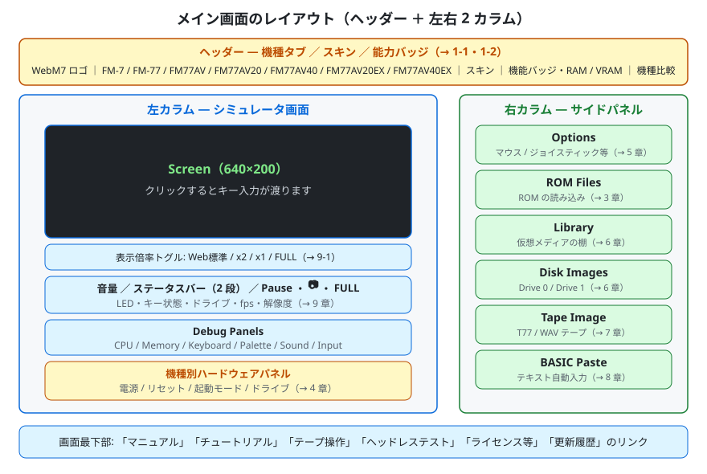
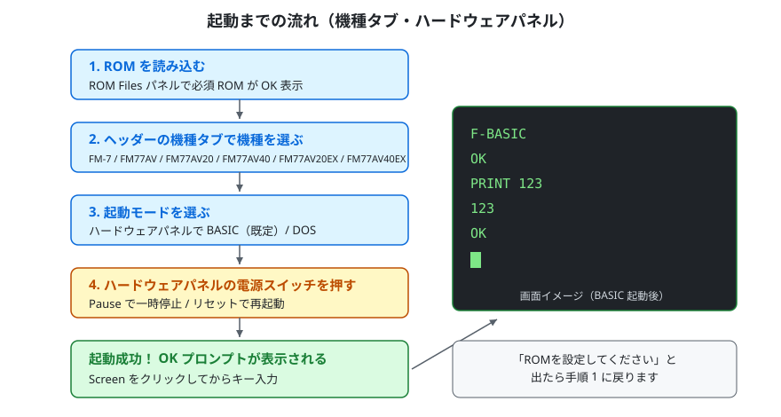
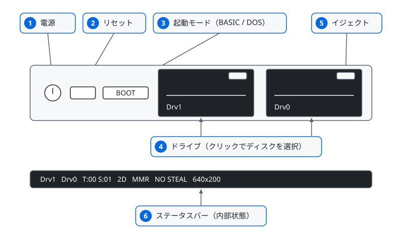
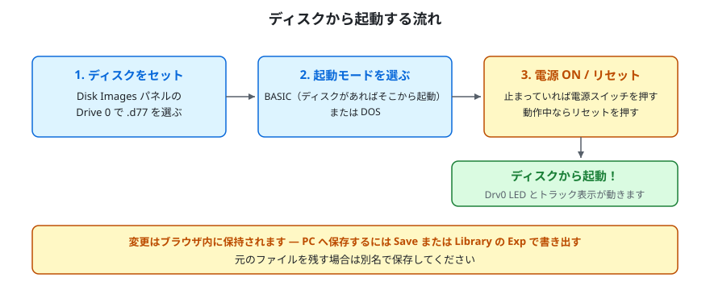
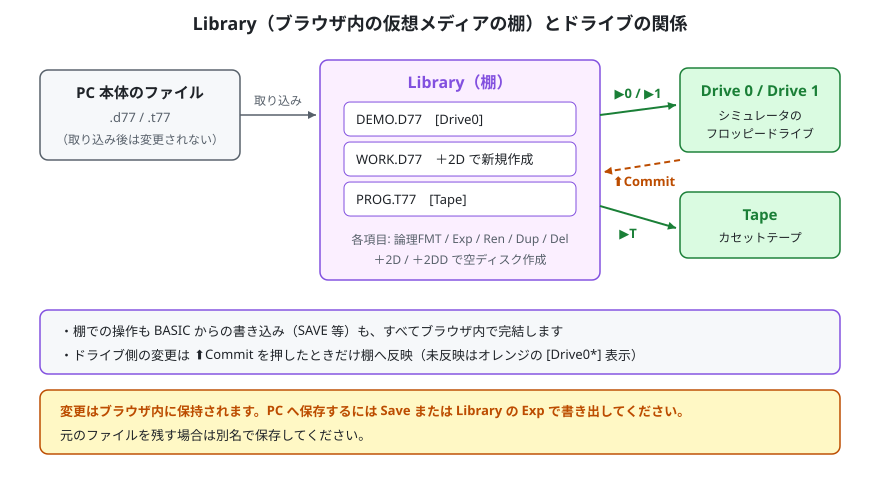
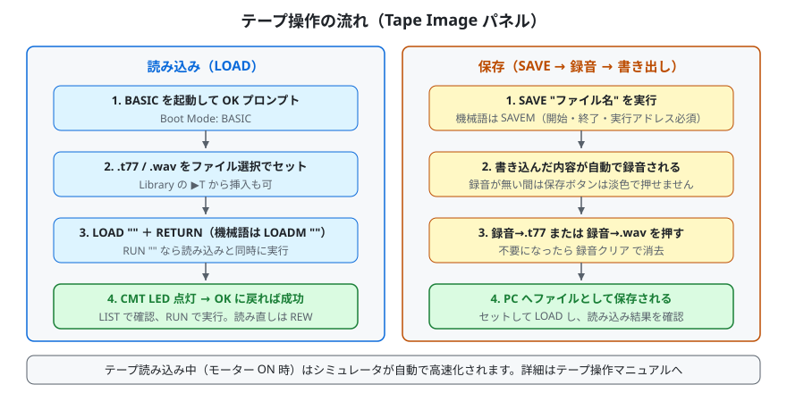
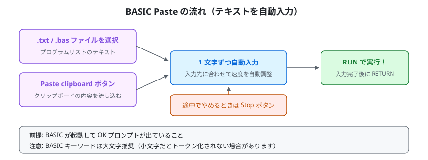
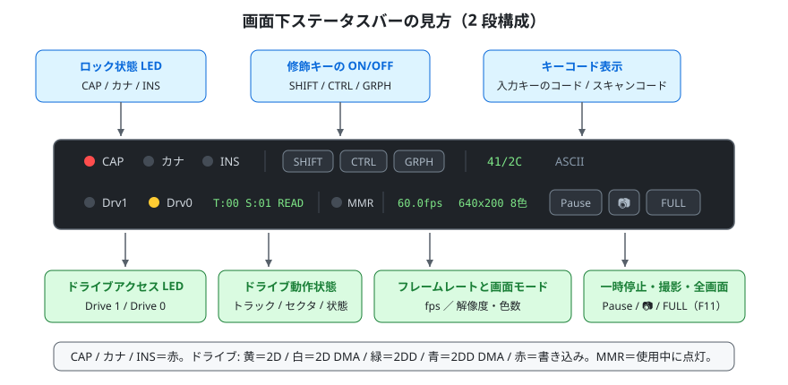
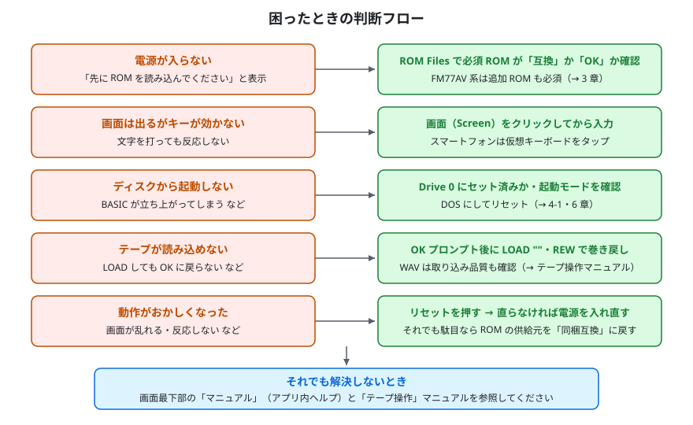

# WebM7 チュートリアル — はじめてガイド

WebM7 をはじめて使う方向けのチュートリアルです。機種の選び方から BASIC の起動、ディスク・テープ・BASIC Paste の基本操作まで、「動かせた！」に到達するまでの手順を図解中心で説明します。

---

## 1. WebM7 とは

WebM7 は、8bit パソコン **FM-7 / FM77AV シリーズ**（FM-7 / FM-77 / FM77AV / FM77AV20 / FM77AV20EX / FM77AV40 / FM77AV40EX/SX）をブラウザ上で再現するシミュレータです。

- **インストール不要** — ページを開くだけで動きます。アプリのダウンロードや実行ファイルのインストールは要りません
- **すべてブラウザ内で完結** — ROM やディスクのデータがサーバーへ送信されることはありません。処理はすべてお使いの PC・スマートフォンのブラウザ内で行われます
- **PWA 対応** — 対応ブラウザでは「アプリとしてインストール」でき、ホーム画面やデスクトップから起動できます
- **PC でもスマートフォン / タブレットでも** — タッチ端末では画面下にソフトウェアキーボードが表示されます

図1: 画面はヘッダーと左右 2 カラムの構成です。左がシミュレータ画面と機種別のハードウェアパネル、右が操作用のサイドパネルです。

| 場所 | 内容 |
|---|---|
| ヘッダー | WebM7 のロゴ、**機種タブ**、**スキン**の切り替え（対応機種のみ）、選択中の機種の機能バッジと `RAM ○○KB / VRAM ○○KB` 表示、「機種比較」リンク |
| 左カラム | Screen（映像出力）、表示倍率トグル（Web標準 / x2 / x1 と、右端に FULL）、音量・ステータスバー（Pause・📷 を含む）、Debug Panels ボタン列、機種別ハードウェアパネル（電源・リセット・起動モード・ドライブ） |
| 右カラム | Options / ROM Files / Library / Disk Images / Tape Image / BASIC Paste の各パネル |
| 画面最下部 | マニュアル・チュートリアル・テープ操作・ヘッドレステスト・ライセンス等・更新履歴へのリンク |

### 1-1. 機種を選ぶ（ヘッダーの機種タブ）

機種の切り替えは、ヘッダーに並ぶ**機種タブ**で行います。左から順に次の 7 つです。

**FM-7** ／ **FM-77** ／ **FM77AV** ／ **FM77AV20** ／ **FM77AV40** ／ **FM77AV20EX** ／ **FM77AV40EX**

- タブをクリックするとその機種に切り替わり、選択はブラウザに保存されます。次回開いたときも同じ機種で始まります
- **FM77AV40EX** タブは FM77AV40EX / FM77AV40SX を兼ねます（エミュレーションとしては同一機種扱いです）
- シミュレータの動作中は機種を変えられません。タブは淡色表示になります。切り替えたいときは一度電源を切ってください
- タブの右には、選択中の機種が持つ機能のバッジ（**MMR/TWR / 77AV機能 / 2DD / DMAC / 高速MMR / AV40機能 / 40EX機能**）と、メイン RAM・VRAM の容量が表示されます。「**機種比較**」リンクで機種ごとの機能一覧表を開けます

### 1-2. 見た目を選ぶ（スキン）

機種によっては、タイトルバーの右端に「**スキン**」の切り替えが現れます。スキンで変わるのは**見た目だけ**で、エミュレーションの機能・動作は一切変わりません。選んだスキンは機種ごとにブラウザへ保存され、次回も同じ見た目で開きます。

| 機種タブ | 選べるスキン |
|---|---|
| FM-7 | **FM-7**（既定） / **FM-NEW7** |
| FM77AV40EX | **FM77AV40EX**（既定） / **FM77AV40SX** |

- 画面上部のタイトルバー（黒地）と、ページの背景・右側のパネル（クリーム色を基調とした明るい配色）は、どの機種・スキンでも同じです。スキンで配色が変わるのは、画面の下（または右）にある**ハードウェアパネル（本体の前面）だけ**です
- ハードウェアパネルは、機種ごとの配色の操作パネルです
- スキンによってハードウェアパネルの形（縦置きのドライブユニット／横長のバー）が変わり、電源・リセット・起動モードの位置も変わります（→ 4 章）
- スキンを選べない機種（FM-77 / FM77AV / FM77AV20 / FM77AV40 / FM77AV20EX）では、その機種に合わせた見た目が自動で選ばれます

---

## 2. 準備するもの

| 必要なもの | 説明 |
|---|---|
| 対応ブラウザ | 最近の主要ブラウザ（PC / スマートフォン / タブレット） |
| （任意）ROM ファイル | 既定では同梱の互換 ROM セットで動作するため用意は不要です。お手持ちの ROM を使う場合のみ、ご自身が適法に所有する実機から取得したものを用意してください（後述） |
| （任意）ディスク / テープイメージ | D77 / T77 / WAV 形式のメディアイメージ |
| （任意）ゲームパッド | USB / Bluetooth 接続。自動認識されます |

**ROM ファイルについて（重要）**

- WebM7 は既定で、独立実装の互換 ROM セット [7032 Alternative ROMs](https://github.com/7032JP/7032AltROMs/tree/v1.0.3)（MIT License）を同梱・使用します。**ROM ファイルを用意しなくてもそのまま起動できます**（漢字 ROM も同梱されており、漢字表示に対応しています。ソフトウェアの動作条件は、下記の互換 ROM の互換性情報を参照してください。第2水準漢字 ROM・辞書 ROM は FM77AV40EX/SX でのみ使用されます）。漢字系 ROM の字形の扱いは [LICENSE-Shinonome.md](../LICENSE-Shinonome.md) を参照してください。同梱の辞書 ROM は、かな漢字変換（日本語入力）には対応していません。
- 同梱互換 ROM の BASIC は、プログラムをアスキー形式（`SAVE ,A` と同じ形式）だけで読み書きします。中間コード（バイナリ）形式で保存されたファイルは読み込めません（[COMPATIBILITY.md §3.2](https://github.com/7032JP/7032AltROMs/blob/v1.0.3/docs/COMPATIBILITY.md)）。お手持ちのプログラムファイルをそのまま使う場合は、`FBASIC30.ROM` の行を「自分の ROM」に切り替えてください。保護保存（`SAVE` の `,P` 指定）にも対応していません。機械語ファイル（`SAVEM` / `LOADM`）の形式は従来どおりです
- お手持ちの ROM は、ご自身が適法に所有する実機から取得したものをお使いください。
- WebM7 は利用者の ROM をブラウザ内（ローカル環境）でのみ処理します。ROM がサーバーへ送信・保存されることはありません

---

## 3. ROM の供給元を選ぶ・ROM を読み込む（ROM Files パネル）

**既定（同梱互換 ROM）のまま使う場合、この章の操作は不要です。** そのまま「4. 起動する」へ進んでください。

WebM7 は同梱の互換 ROM セットを常に土台として動作し、そのうえで **ROM 1 本（スロット）ごとに供給元を選べます**。お手持ちの ROM を使いたいときは、サイドパネルの **ROM Files** を開き、次のどちらかを行ってください。

1. **差し替えたい ROM の行の選択を「自分の ROM」に変える** — その行だけがお手持ちの ROM を使う設定になります（ファイルはこの後の手順で読み込みます）
2. **その行にファイルを読み込む** — ROM ファイルを読み込むと、**その行だけ**自動的に「自分の ROM」へ切り替わります

たとえば `FBASIC30.ROM` だけ、あるいは `KANJI.ROM` だけをお手持ちのものにして、残りは同梱互換のまま使う、といった使い分けができます。指定はブラウザに保存され、次回以降も維持されます（供給元の切り替えは、シミュレータの停止中に操作してください）。

現在どの組み合わせで動いているかは、パネル上部の **ROM Set** 表示で確認できます。すべて同梱互換なら「同梱互換 ROM」、すべてお手持ちのものなら「自分の ROM」、混ざっているときは「同梱互換 ROM ＋ 自分の ROM n 件」と表示されます。

なお、「自分の ROM」に指定した行のファイルがまだそろっていなくても、**その行だけ**同梱の互換 ROM で自動的に補って起動できます（設定は不要です）。お持ちの ROM はそのまま使われ、互換 ROM で置き換わることはありません（補われた ROM には「補完」と表示されます）。

### 3-1. 機種別に必要な ROM

図2: 機種が上位になるほど、必要な ROM が積み増しになります。

| 機種 | 必要な ROM |
|---|---|
| FM-7 / FM-77 | `FBASIC30.ROM`（必須）、`SUBSYS_C.ROM`（必須）、`BOOT_BAS.ROM`（起動モード BASIC で必須）、`BOOT_DOS.ROM`（起動モード DOS で必須）、`KANJI.ROM`（任意。漢字表示ソフト用） |
| FM77AV / FM77AV20 / FM77AV40 / FM77AV20EX | `FBASIC30.ROM` / `SUBSYS_C.ROM` に加えて `INITIATE.ROM` / `SUBSYS_A.ROM` / `SUBSYS_B.ROM` / `SUBSYSCG.ROM`（いずれも必須）。`KANJI.ROM` もこの機種では必須。`BOOT_BAS.ROM` / `BOOT_DOS.ROM` は不要 |
| FM77AV40EX | さらに `EXTSUB.ROM` / `DICROM.ROM` / `KANJI2.ROM`（いずれも必須） |

各 ROM の役割はアプリ内ヘルプ（画面最下部の「マニュアル」リンク）の「1. ROM の供給元を選ぶ / ROMファイルを読み込む」に一覧表があります。

### 3-2. 読み込みの手順

図3: フォルダ一括選択がおすすめです。個別指定でも読み込めます。

読み込み方法は 2 通りあります。

1. **Folder（一括選択）** — ROM ファイルが入ったフォルダを選ぶと、含まれるファイルをまとめて自動で割り当てます
2. **個別指定** — 各 ROM の行で 1 ファイルずつ選択します

### 3-3. 読み込み状態の見方

- 各 ROM の横のタグで状態が分かります。**OK**（「自分の ROM」を指定していてファイルも読み込み済み）／**互換**（「同梱互換」を指定）／**補完**（「自分の ROM」を指定しているがファイルが未登録で、同梱互換 ROM で補って動作）
- ROM 名の横の「必須」「任意」バッジで、その機種の起動に最低限必要なファイルが分かります
- **ROM Info** を開くと、読み込み済み ROM のサイズ・ハッシュを確認できます（Copy ボタンでコピー可能）
- 読み込んだ ROM はブラウザに保存され、次回からは自動で復元されます。ROM だけを消したいときは **Clear ROMs**、ROM とディスクをまとめて消したいときは **Clear Saved** ボタンを押してください（**Clear ROMs** を押すと、供給元の指定もすべて「同梱互換」に戻ります）

---

## 4. 起動する（機種タブ・ハードウェアパネル）

準備ができたら、いよいよ起動です。電源・リセット・起動モード（BASIC / DOS）は、機種ごとの配色の**ハードウェアパネル**にまとまっています。ハードウェアパネルは、FM-7（FM-7 / FM-NEW7 スキン）では画面の右側に縦置きのドライブユニットとして、そのほかの機種では画面の下に横長のバーとして表示されます。

図4: ROM の供給元の確認 → 機種選択 → 起動モード選択 → 電源 ON、の 4 ステップです（既定のままなら手順 1 は確認のみ）。

1. ヘッダーの**機種タブ**で機種を選びます（→ 1-1）
2. **起動モード**を選びます。操作する場所は機種・スキンによって変わります（→ 4-1）
   - **BASIC**（既定） — BASIC モードの起動 ROM で起動します。ディスクがセットされていればディスクから起動し、無ければ BASIC（同梱互換 ROM では 7T-BASIC）が立ち上がります
   - **DOS** — DOS モードの起動 ROM で起動します。起動できるディスクをあらかじめセットしておいてください
3. ハードウェアパネルの**電源スイッチ**を押します
4. 画面に BASIC が立ち上がり、**`OK` プロンプト**が表示されれば起動成功です

### 4-1. ハードウェアパネルの操作部（機種・スキン別）

同じ機能でも、機種とスキンによって操作部の見た目と位置が変わります。

図は横長のバーを模した模式図です。各部の役割はどの機種・スキンでも共通です。

| 機種（スキン） | 電源 | リセット | 起動モード |
|---|---|---|---|
| FM-7（FM-7 / FM-NEW7） | パネル右上のロッカースイッチ | 電源の左隣の丸ボタン（**RESET**） | RESET の左の 4 連 DIP スイッチ。左端の **BOOT** レバーをクリックするたびに BASIC / DOS が入れ替わります |
| FM-77 | バー左側の **POWER** ボタン | 前面下部のボタン列の「リセット」 | 同じボタン列の **BOOT** ボタン。押すたびに切り替わり、ボタン面に現在のモード（`BAS` / `DOS`）が出ます |
| FM77AV / FM77AV20 / FM77AV40 | バー右側の大きな電源ボタン | 下部の帯の右端にある小さな丸ボタン | 下部の帯の **BASIC** / **DOS** ボタン |
| FM77AV20EX / FM77AV40EX / FM77AV40SX | バー左側の電源ボタン | 右列の「リセット」ボタン | 右列の **BASIC** / **DOS** ボタン |

- ドライブの取り出しもハードウェアパネルから行えます。FM-7（FM-7 / FM-NEW7 スキン）ではスロット横の**レバー**、そのほかの機種ではスロット下の**イジェクトボタン**です
- ドライブのアクセスランプ、セットしているディスクの名前もハードウェアパネルに表示されます
- 起動モードはシミュレータの動作中は変えられません。切り替えたいときは一度電源を切ってください

起動後のポイント:

- **画面（Screen）をクリック**すると、キーボード入力がシミュレータへ渡るようになります
- まずは `PRINT 123` ＋ RETURN などを打ってみてください。`123` と表示されれば BASIC が動いています
- キーの位置が分からないときは[キーボードマニュアル](Keyboard_Manual.md)をご覧ください。BREAK / GRPH / カナ などが、お使いのキーボードのどのキーに当たるかを図で説明しています
- 画面下のステータスバーの **Pause** で一時停止し、もう一度押すと再開します。作り直したいときはハードウェアパネルの**リセット**、止めたいときは**電源スイッチ**をもう一度押します
- 必須 ROM が足りないときは電源スイッチが淡色表示になり、押しても「ROMを設定してください」という案内が出ます。Options パネルにも「先に ROM を読み込んでください」と表示されます（→ 3 章）

---

## 5. 入力デバイス（ジョイスティック／マウス）

プログラムによっては、キーボードに加えてジョイスティックやマウスを使います。いずれもサイドパネルの **Options パネル**で設定します。

Options パネルには次の設定が並びます。

| 項目 | 内容 |
|---|---|
| **FM Sound Card** | FM 音源カード（OPN）を有効にします。FM-7 を選んでいるときだけ表示されます（FM77AV 系は内蔵のため設定不要）。反映は次の電源投入またはリセット時です |
| **Mouse** | 接続するマウスの種類（→ 5-2） |
| **Joystick 1** / **Joystick 2** | ポート 1 / ポート 2 に割り当てるゲームパッド（→ 5-1） |
| **Cursor → Ten Key** | カーソルキー（↑↓←→）をテンキーの 8 / 2 / 4 / 6 として扱います |

機種の選択・電源・リセット・起動モードは Options パネルではなく、ヘッダーの機種タブと機種別ハードウェアパネルにあります（→ 1-1・4 章）。

### 5-1. ジョイスティック

- **Joystick 1** / **Joystick 2** の欄で、ポート 1 / ポート 2 それぞれに、お使いの USB ゲームパッドを個別に割り当てられます。接続済みのゲームパッドが選択肢に並ぶので、使いたいものを選んでください（割り当てないときは **(None)**）。
- 十字方向の 8 方向と 2 ボタンに対応します。テンキーレス等でキーボードのカーソルキーをテンキーの 2 / 4 / 6 / 8 代わりに使う設定は「**Cursor → Ten Key**」で行えます。

### 5-2. マウス

Options パネルの **Mouse** で、接続するマウスの種類を選びます。次の選択肢が並びます。

- **(None)** — マウスを接続しません（既定）
- **Mouse Set (bus)** — バスマウス（マウスセット）方式。全機種で利用できます
- **Intelligent Mouse (Port 1) / (Port 2)** — ジョイスティックポート経由で接続する方式。**FM 音源カードが必要**です（搭載していない構成では選べません）。使用するポートを 1 / 2 から選びます

選んだ種類はブラウザに保存され、次回起動時に復元されます。機種や FM 音源カードの有無に応じて、選べる項目は自動で切り替わります。

- **画面（Screen）をクリック**すると、マウス操作がシミュレータへ渡ります。カーソルの移動量は表示倍率やフルスクリーンに合わせて自動調整され、画面上のポインタと概ね一致して動きます。

---

## 6. ディスクで遊ぶ（Disk Images / Library パネル）

D77 形式のディスクイメージから起動する手順です。

図5: ディスクを Drive 0 にセットし、起動モードを BASIC（または DOS）にして起動します。

### 6-1. シンプルに 1 枚を試す（Disk Images パネル）

1. **Disk Images** パネルの **Drive 0** のファイル選択で `.d77` を開きます
2. ファイル名と、ディスク情報（2D / 2DD、シリンダ数 C・サイド数 H・トラック当たりセクタ数 R・セクタ当たりバイト数 N）が表示されます
3. 起動モードを **BASIC** または **DOS** にします（BASIC のままでも、ディスクがセットされていればディスクから起動します）
4. ハードウェアパネルの**電源スイッチ**を押します（すでに動いているときは**リセット**）。ディスクから起動します

そのほかの操作:

- **Eject** — ディスクを取り出します
- **Save** — 現在のディスクイメージを `.d77` として PC へ書き出します（元のファイルを残す場合は別名で保存してください）
- **Drive Sound** — ディスク動作音の ON/OFF と音量を調整できます

**書き込みについて（重要）** — BASIC の `SAVE` などでディスクへ書き込んだ変更はブラウザ内に保持されます。PC へ保存するには Save または Library の Exp で書き出してください。元のファイルを残す場合は別名で保存してください。

### 6-2. 複数イメージを管理する（Library パネル）

図6: Library はブラウザ内の「仮想メディアの棚」です。棚からドライブ / テープへ挿入して使います。

**Library** は、ディスク（D77）とテープ（T77）をブラウザ内で管理する棚です。複数のイメージを取り込んでおき、使いたいものをドライブへ挿入できます。

- **取り込み（ファイル選択）** — PC の `.d77` / `.t77` を棚に追加します
- **＋2D / ＋2DD** — 論理フォーマット済みの空ディスクを新規作成します（DISK BASIC からすぐ `SAVE` できます）
- **▶0 / ▶1 / ▶T** — 棚の項目を Drive 0 / Drive 1 / Tape へ挿入します
- **⬆Commit** — ドライブ側の未反映の変更を、明示的に押したときだけ棚側へ反映します（未反映の項目はオレンジ色の `[Drive0*]` のように表示されます）
- **論理FMT** — ディスクを論理フォーマット（FAT・ディレクトリを初期化）して、書き込みできる状態にします
- **Exp / Ren / Dup / Del** — 書き出し / 名前変更 / 複製 / 削除

Library 内の操作や BASIC からの書き込みによる変更はブラウザ内に保持されます。PC へ保存するには Save または Library の Exp で書き出してください。元のファイルを残す場合は別名で保存してください。

---

## 7. テープを使う（Tape Image パネル）

T77 形式・WAV 形式のカセットテープイメージを使えます。

図7: 左が読み込み（LOAD）、右が保存（SAVE → 録音 → ファイル書き出し）の流れです。

### 7-1. テープから読み込む（LOAD）

1. BASIC モードで起動して `OK` プロンプトを出しておきます（→ 4 章）
2. **Tape Image** パネルのファイル選択で `.t77` または `.wav` を開きます
3. BASIC で次のように入力します
   - BASIC プログラム … `LOAD ""` ＋ RETURN（`RUN ""` なら読み込みと同時に実行）
   - 機械語 … `LOADM ""` ＋ RETURN
4. 読み込み中は **CMT LED** が点灯します。テープ読み込み中（モーター ON 時）はシミュレータが自動的に高速化されます
5. `OK` に戻ったら成功です。`LIST` で確認し、`RUN` で実行します

同じテープを読み直すときは **REW**（巻き戻し）、取り出すときは **Eject** を押します。

### 7-2. テープへ保存する（SAVE）

1. BASIC で `SAVE "ファイル名"`（機械語は `SAVEM`）を実行すると、内容が自動的に**録音**されます
2. **録音→.t77** ボタンで T77 形式、**録音→.wav** ボタンで PCM WAV 形式として PC へ保存できます
3. **録音クリア** で録音内容を消去します（録音が無いときは保存ボタンは淡色表示になり押せません）

より詳しい手順は次のマニュアルを参照してください。

- [テープ操作マニュアル](Tape_Manual.md)

---

## 8. BASIC Paste の使い方

ご自身で作成したプログラムリストなどのテキストを、BASIC の画面へ 1 文字ずつ自動入力できる機能です。

図8: BASIC の起動後に、ファイルまたはクリップボードからテキストを流し込みます。

1. BASIC モードで起動して `OK` プロンプトを出しておきます
2. **BASIC Paste** パネルで入力元を選びます
   - **ファイル選択** — `.txt` / `.bas` ファイルを選ぶ
   - **Paste clipboard** — クリップボードの内容を流し込む
3. テキストが 1 文字ずつ自動入力されます。入力先の処理に合わせて速度を自動調整します
4. プログラムリストを貼り付けた場合は、入力完了後に `RUN` ＋ RETURN で実行します

- 途中でやめたいときは **Stop** ボタンを押します
- BASIC キーワードは**大文字**を推奨します（小文字だと命令として解釈されない場合があります）

---

## 9. 画面下ステータスバーの見方

シミュレータ画面のすぐ下には、表示倍率のトグルと、動作状態をまとめたステータスバー（2 段構成）があります。

図9: 1 段目はキーボード関連、2 段目はドライブ・画面情報です。

| 段 | 表示 | 意味 |
|---|---|---|
| 1 段目 | CAP / カナ / INS の LED | キーボードのロック状態（CapsLock・カナ・挿入モード） |
| 1 段目 | SHIFT / CTRL / GRPH | 修飾キーの ON/OFF 状態 |
| 1 段目 | キーコード表示 | 入力したキーのコード / スキャンコード |
| 2 段目 | Drv1 / Drv0 の LED | 各ドライブのアクセスランプ。**黄＝2D / 白＝2D DMA / 緑＝2DD / 青＝2DD DMA / 赤＝書き込み** |
| 2 段目 | `T:トラック S:セクタ 状態` | ドライブの動作状態（読み書き中のトラック・セクタ） |
| 2 段目 | MMR の LED | メモリ管理機能（MMR/TWR）の使用中に点灯。高速MMR動作中は緑 |
| 2 段目 | フレームレート | 描画フレームレート（fps） |
| 2 段目 | 解像度 / 色数 | 現在の画面モード（例: 640×200 8色） |

- ステータスバーの CAP / カナ / INS の LED は、点灯するとどの機種でも赤です（前面パネルのキーボード LED の色は機種の見た目に合わせて少し異なります）
- 左端のスピーカーアイコンとスライダーで音量調整（アイコンクリックでミュート切替）
- 2 段目の右端には次のボタンが並びます
  - **Pause** — 一時停止と再開（動作中のみ押せます）
  - **📷** — 現在の画面を PNG 画像として保存します（640×200 モード・320×200 モードとも 640×400 ピクセルで保存されます）

### 9-1. 表示倍率（Web標準 / x2 / x1）とフルスクリーン（FULL）

ステータスバーの上、画面のすぐ下にある「表示」のトグルで、画面の大きさを切り替えられます。選んだ設定はブラウザに保存されます。

| ボタン | 表示 |
|---|---|
| **Web標準** | ウィンドウの大きさに合わせて自動調整します（既定） |
| **x2** | 2 倍表示。常に 1280×800 デバイスピクセル（1 ドット＝2×2 デバイスピクセル）で表示します |
| **x1** | 厳密な等倍表示。常に 640×400 デバイスピクセル（1 ドット＝1 デバイスピクセル）で表示します |
| **FULL** | フルスクリーン表示の切り替え（F11 キーでも同じ）。もう一度押すと元に戻ります。倍率の選択とは独立したボタンです |

x2 / x1 を選ぶと、トグルの右に「等倍 (640x400 デバイスピクセル)」のように現在の状態が表示されます。画面が高精細（高 DPI）な環境では x1 の表示が小さくなりますが、これは 1 ドットを 1 デバイスピクセルへ正確に対応させた結果です。スマートフォン・タブレットでは常に Web標準の表示となり、倍率の選択は表示されません（FULL は残ります）。

---

## 10. 困ったときは

図10: 起動しない・動かないときは、上から順に確認してください。

| 症状 | 確認すること |
|---|---|
| 電源が入らない / 「先に ROM を読み込んでください」と出る | ROM Files パネルで、選択中の機種の**必須 ROM が「互換」または「OK」**になっているか確認（→ 3 章）。お手持ちの ROM を使う場合、FM77AV 系は追加 ROM も必要です |
| 画面は出るがキーが効かない | **画面（Screen）をクリック**してから入力する。スマートフォンではソフトウェアキーボードをタップ |
| 記号のキーが思ったとおりに入らない / BREAK や GRPH が分からない | [キーボードマニュアル](Keyboard_Manual.md)の対応図で位置を確認し、必要ならキーカスタマイズで割り当て直す |
| ディスクから起動しない | ディスクが **Drive 0** にセットされているかを確認し、ハードウェアパネルの**リセット**を押す。それでも駄目なら起動モードを **DOS** にして試す（→ 4-1） |
| BASIC を出したいのにディスクから起動してしまう | 起動モードを **BASIC** にしたうえで、ディスクを取り出してからリセットする |
| 機種タブ・起動モードが押せない | シミュレータの動作中はロックされます。電源を切ってから操作してください |
| テープが読み込めない | `OK` プロンプトが出てから `LOAD ""` を入力。WAV の場合は取り込み品質も影響します（→ テープ操作マニュアル） |
| 動作がおかしくなった | ハードウェアパネルの**リセット**、それでも直らなければ電源を切って入れ直す |
| 画面の下に「新しいバージョンが利用できます」と出た | **再読み込み**を押すと新しいバージョンに切り替わります。今の操作を続けたいときは**閉じる**を押してください（次に開き直したときに新しいバージョンになります） |
| 更新したはずなのに古い内容のまま動く | **強制再読み込み**（Windows: `Ctrl` + `Shift` + `R` / Mac: `Command` + `Shift` + `R`）を 2 回続けて行う。それでも変わらなければプライベートウィンドウで開き直す |

さらに詳しい情報は次を参照してください。

- **アプリ内ヘルプ** — 画面最下部の「**マニュアル**」リンク。各パネルの **?** アイコンからも該当箇所を開けます
- [キーボードマニュアル](Keyboard_Manual.md) — キー配置、固有キーと物理キーボードの対応、キーの割り当て変更
- [テープ操作マニュアル](Tape_Manual.md) — テープの読み書き手順の詳細と、WAV テープの取り込みのコツ・注意点
- **更新履歴** — 画面最下部の「更新履歴」リンク（CHANGELOG）

